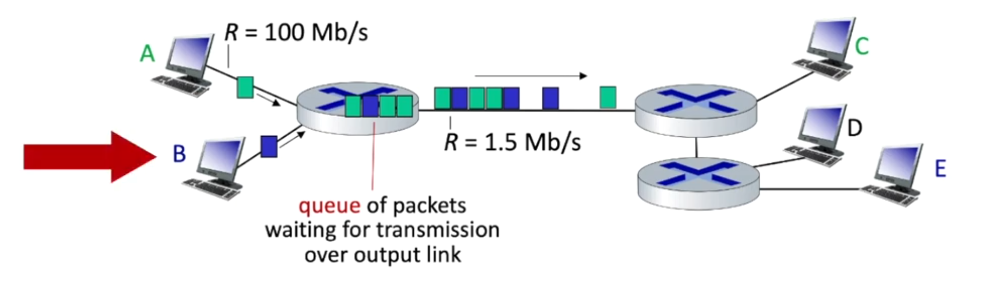
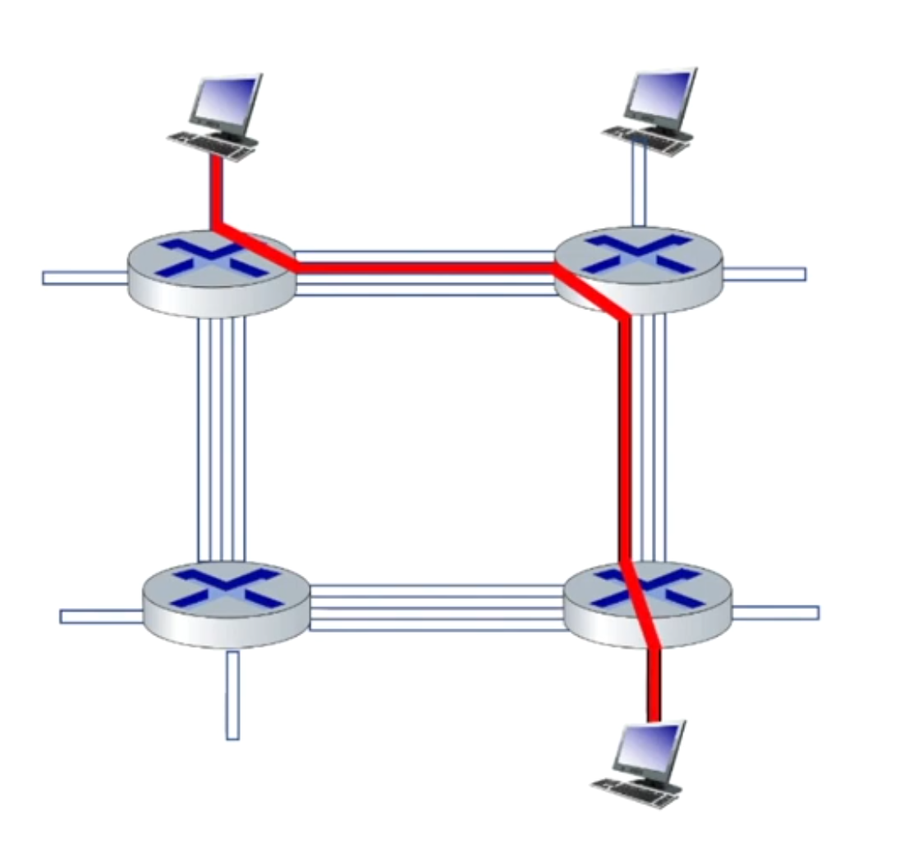
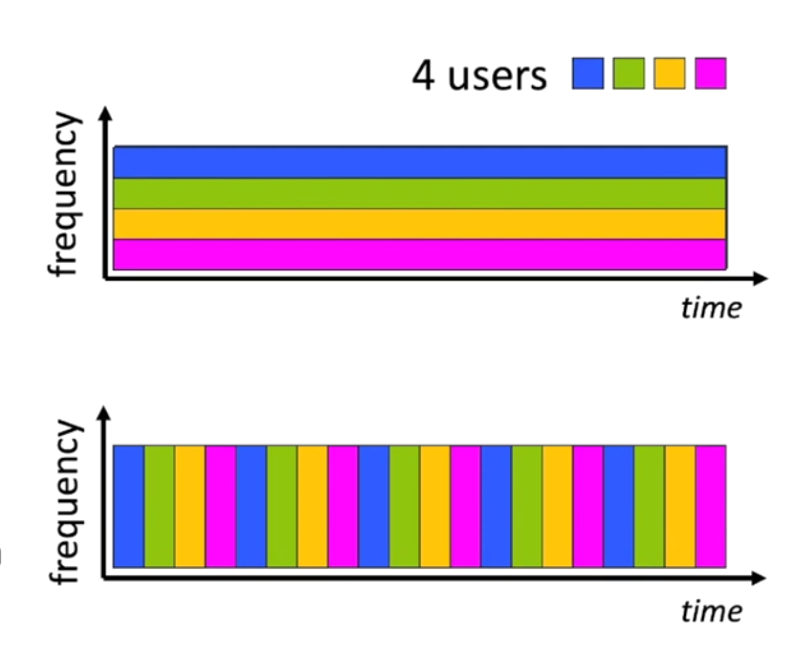
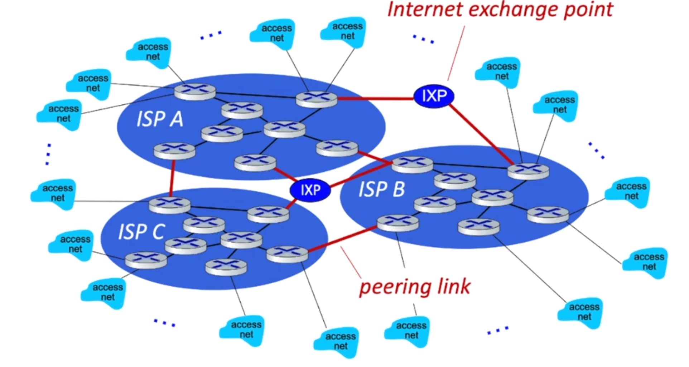
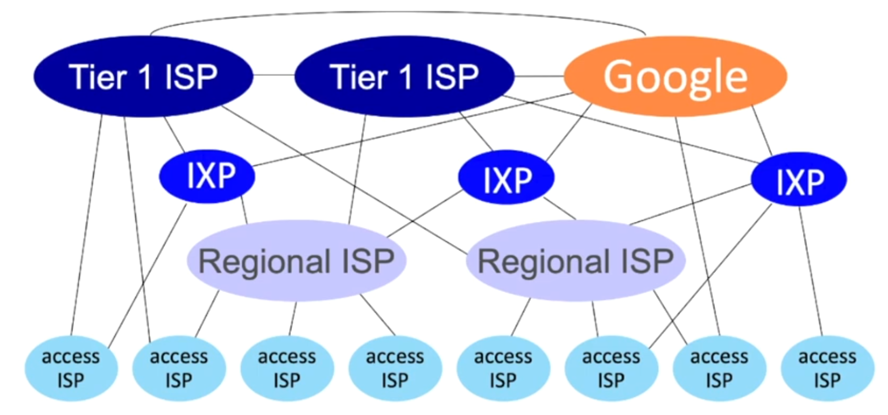
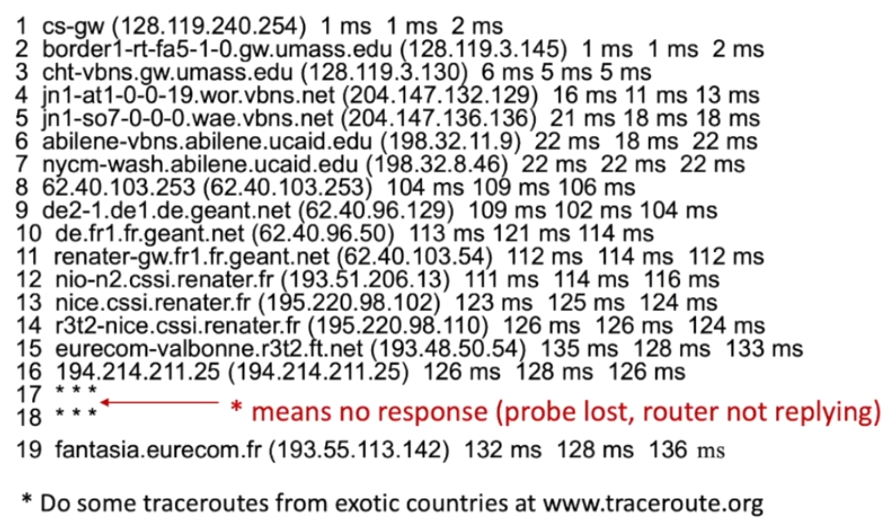
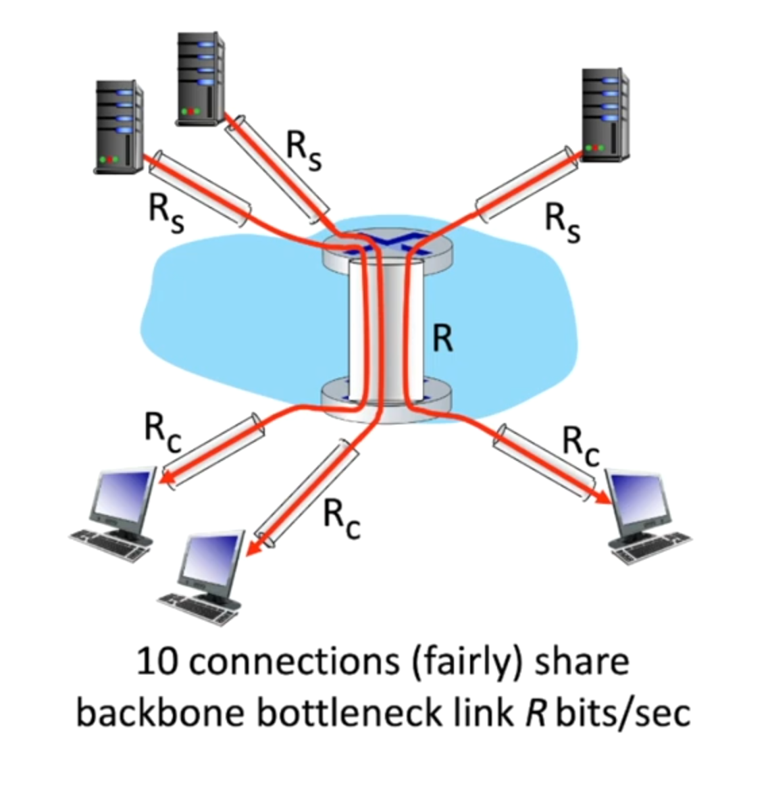
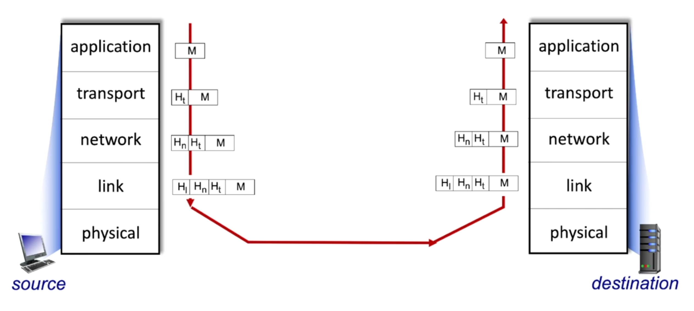

# Chapter 1: Introduction to Computer Networks

## 1.1 What is the Internet?

### Internet
- The Internet is a global interconnected network of networks that connects billions of computing devices worldwide.
- These connected devices are called **hosts** or **end systems**.
- End systems are connected together by a network of **communication links** and **packet switches**.

> Exam Question: What is Internet?

### Protocol
- Sending and receiving information between routers, switches, and other end devices is controlled by protocols. Protocols govern everything that happens in a network.
- Protocols define the **format**, **order of messages** sent and received among network entities, and **actions taken** on message transmission and receipt.
- Examples: TCP, IP, HTTP, FTP, PPP, Ethernet

> Exam Question: What is Protocol?

> **IETF:** The **Internet Engineering Task Force** governs the Internet standards using documents called **RFC (Request for Comments)**.

---

## 1.2 Network Edge

### Access Networks
An access network is the network that physically connects an end system (host) to the first router (edge router) on a path from the end system to any other distant end system.

**How to connect host systems to edge router?**

There are several ways:
- Residential access networks (DSL, Cable, FTTH, 5G Fixed Wireless)
- Institutional access networks (school, company)
- Mobile access networks (WiFi, 4G/5G cellular)

**Key characteristics to consider:**
- **Transmission rate** (bits per second) - how fast is the network
- **Shared or dedicated access** - to what degree the network bandwidth is shared among users

### Access Networks: Cable-based Access
In cable-based access networks, a single cable head-end connects multiple homes. The signals from and to those houses are sent at different frequencies. Different frequencies do not interfere with each other, similar to FM radio frequencies.

- **Frequency Division Multiplexing (FDM):** Different channels are transmitted in different frequency bands simultaneously.
- **HFC (Hybrid Fiber Coax):** A network architecture that uses fiber optic cables for the backbone and coaxial cables for the "last mile" to homes.
  - **Asymmetric:** Provides higher data rates downstream (to the user) than upstream (from the user)
  - Downstream: 40 Mbps - 1.2 Gbps
  - Upstream: 30-100 Mbps
  - Bandwidth is **shared** among users in the same neighborhood

### Access Networks: Digital Subscriber Line (DSL)
- Uses existing telephone line to central office **DSLAM (Digital Subscriber Line Access Multiplexer)**
  - **DSLAM:** A network device located at the telephone company's central office that receives signals from multiple DSL connections and aggregates them onto a high-speed backbone
- Data over DSL phone line goes to the Internet
- Voice over DSL phone line goes to the telephone network
- Uses different frequencies for voice and data:
  - 0-4 kHz: Voice (traditional phone)
  - 4-50 kHz: Upstream data
  - 50 kHz - 1 MHz: Downstream data
- **Dedicated** connection (not shared with neighbors)
- Speeds:
  - 24-52 Mbps dedicated downstream transmission rate
  - 3.5-16 Mbps dedicated upstream transmission rate

### Access Networks: Fiber to the Home (FTTH)
- Provides fiber optic connection directly to the home
- Much higher speeds than DSL or cable (up to 1 Gbps or more)
- Two competing optical distribution architectures:
  - **AON (Active Optical Network):** Uses electrically powered switching equipment
  - **PON (Passive Optical Network):** Uses unpowered optical splitters

### Home Networks
A typical home network consists of:
- **Modem:** Converts signals between the ISP's network and your home network
  - Cable modem for cable internet
  - DSL modem for DSL internet
- **Router:** Routes packets between your home network and the Internet
  - Performs NAT (Network Address Translation)
  - Contains a firewall for security
- **Wireless Access Point (WAP):** Provides WiFi connectivity
- **Switch/Hub:** Connects multiple wired devices (often integrated into the router)

Most home networks today use a combined device (modem-router combo or gateway) that integrates all these functions.

### Wireless Access Networks

#### 1. Wireless Local Area Networks (WLANs) - WiFi
- Range: Typically within or around a building (~100 ft / 30 meters)
- Standardized by IEEE under the 802.11 family of protocols:
  - 802.11b: 11 Mbps, 2.4 GHz
  - 802.11g: 54 Mbps, 2.4 GHz
  - 802.11n (WiFi 4): up to 600 Mbps, 2.4/5 GHz
  - 802.11ac (WiFi 5): up to 3.5 Gbps, 5 GHz
  - 802.11ax (WiFi 6): up to 9.6 Gbps, 2.4/5/6 GHz

#### 2. Wide-Area Cellular Access Networks
- Provided by mobile/cellular network operators
- Range: 10's of kilometers
- Technologies:
  - 3G: Few Mbps
  - 4G/LTE: 10's of Mbps (up to 100+ Mbps)
  - 5G: 100's of Mbps to multi-Gbps, low latency

### Other Access Networks
1. **Enterprise Networks:** Mix of wired (Ethernet) and wireless (WiFi) technologies, connecting hundreds or thousands of hosts to each other and to the Internet
2. **Data Center Networks:** High-bandwidth networks connecting thousands of servers, often with 10-100 Gbps links

---

## 1.3 Host: Sending and Receiving Data

**Host sending function:**
1. Takes an application message
2. Breaks it into smaller chunks called **packets** of length **L bits**
3. Transmits packets into the access network at **transmission rate R**
   - Transmission rate is also called **link capacity** or **link bandwidth**

> **Packet transmission delay** = time needed to transmit an L-bit packet into a link = **L (bits) / R (bits/sec)**

---

## 1.4 Physical Media (Links)

- **Bit:** The basic unit of data propagated from transmitter to receiver
- **Physical link:** The medium that lies between transmitter and receiver

### 1. Guided Media
Signals propagate in solid media (copper, fiber, coax).

#### Coaxial Cable
- Two concentric copper conductors
- **Bidirectional** transmission
- **Broadband:** Multiple frequency channels on cable
- Speed: 100's Mbps per channel
- Used in: Cable TV, older Ethernet networks

#### Twisted Pair (TP)
- Two insulated copper wires twisted together
- Most common guided transmission medium
- Categories:
  - **Category 5 (Cat5):** 100 Mbps, 1 Gbps Ethernet
  - **Category 5e (Cat5e):** 1 Gbps Ethernet
  - **Category 6 (Cat6):** 10 Gbps Ethernet (up to 55m)
  - **Category 6a (Cat6a):** 10 Gbps Ethernet (up to 100m)

#### Fiber Optic Cable
- Glass fiber carrying light pulses; each pulse represents a bit
- **Advantages:**
  - High-speed point-to-point transmission (10's - 100's Gbps)
  - Low error rate
  - Repeaters can be spaced far apart (up to 100 km)
  - Immune to electromagnetic noise/interference
  - Very thin and lightweight
- **Disadvantages:**
  - Higher cost
  - More difficult to install and splice

### 2. Unguided Media
Signals propagate freely through the air (e.g., radio waves).

#### Wireless Radio
- Signal carried in various "bands" in the electromagnetic spectrum
- No physical "wire"
- Broadcast and "half-duplex" (sender to receiver)
- **Propagation environment effects:**
  - Reflection (off surfaces)
  - Obstruction by objects
  - Interference/noise
  - Multipath propagation

**Radio Link Types:**
| Type | Range | Speed |
|------|-------|-------|
| Wireless LAN (WiFi) | 10's of meters | 10-100's Mbps |
| Wide-area (4G/5G cellular) | ~10 km | 10's-100's Mbps |
| Bluetooth | Short distances (<10m) | 1-3 Mbps |
| Terrestrial microwave | Point-to-point | 45 Mbps channels |
| Satellite | Global coverage | Up to 45 Mbps per channel |

**Satellite Communications:**
- **Geostationary satellites:** 36,000 km altitude, 270 msec round-trip delay
- **Low Earth Orbit (LEO) satellites:** 500-2000 km altitude, 20-40 msec delay (e.g., Starlink)

---

## 1.5 The Network Core

The network core consists of interconnected routers which are connected by communication links. The network core's primary function is to move data among hosts.

### Packet Switching
The Internet uses **packet switching** to move data:
1. End hosts divide application messages into smaller chunks called **packets**
2. Packets are transmitted into the network
3. The network forwards packets from one router to the next, across links on the path from source to destination

### Two Key Network-Core Functions

#### 1. Forwarding (Data Plane)
- **Local action:** Moving packets from router's input to appropriate router output
- When data arrives, it comes with a header containing a destination address
- The router looks up this address in its **forwarding table**
- Based on the match, forwards the packet to the appropriate output link/next router

#### 2. Routing (Control Plane)
- **Global action:** Determining the source-destination paths that packets take
- Routing algorithms compute the local per-router forwarding tables
- These algorithms determine end-to-end paths through the network

> Exam Question: What are routing and forwarding?

---

## 1.6 Packet Switching

### Store and Forward
- **Store and Forward:** The entire packet must arrive at a router before it can be transmitted on the next link
- The router stores the packet in its buffer, then forwards it

**Packet transmission delay:** L/R seconds to transmit (push out) an L-bit packet into a link at R bps

> **Example:** L = 10 Kbits, R = 100 Mbps
> One-hop transmission delay = 10,000 bits / 100,000,000 bps = 0.1 msec

**End-to-end delay (ignoring propagation and processing):**
- For N links: delay = N × (L/R)

### Queuing

When multiple packets arrive at a router simultaneously (e.g., Host A sending to Host C while Host B sends to Host E), they must wait in a queue for transmission.

**Packet Queuing and Loss:**
- If arrival rate (in bps) to a link exceeds transmission rate (bps) for some period:
  - Packets will **queue** (wait) for transmission on the output link
  - Packets can be **dropped (lost)** if the memory (buffer) in the router fills up

### Circuit Switching
Before the Internet, telephone networks used **circuit switching**.

**Characteristics:**
- End-to-end resources are **allocated and reserved** for the "call" between source and destination
- In the diagram, each link has four circuits
  - A call gets the 2nd circuit in the top link and 1st circuit in the right link
- **Dedicated resources:** No sharing with other calls
  - Provides **guaranteed** performance (bandwidth, no queuing delay)
- **Inefficient:** Circuit segment is idle if not used by the call (resources wasted)
- Commonly used in traditional telephone networks

### Types of Circuit Switching

#### 1. Frequency Division Multiplexing (FDM)
- Electromagnetic frequencies are divided into (narrow) frequency bands
- Each call is allocated its own band
- Can transmit at the maximum rate of that narrow band continuously

#### 2. Time Division Multiplexing (TDM)
- Time is divided into slots (frames)
- Each call is allocated periodic slot(s)
- Can transmit at the maximum rate of the (wider) frequency band during its time slot(s)

### Packet Switching vs Circuit Switching

| Feature | Packet Switching | Circuit Switching |
|---------|------------------|-------------------|
| Resource allocation | On-demand, shared | Pre-allocated, dedicated |
| Efficiency | High (statistical multiplexing) | Lower (resources idle when unused) |
| Delay | Variable (queuing delay) | Constant, predictable |
| Congestion | Possible (packet loss) | No congestion once connected |
| Setup time | None | Required before communication |
| Best for | Bursty data (web, email) | Continuous streams (voice calls) |

**Example:**
- 1 Gb/s link
- Each user: 100 Mb/s when "active", active 10% of the time

**Q: How many users can use this network?**
- **Circuit switching:** 10 users (1000 Mbps / 100 Mbps per user)
- **Packet switching:** With 35 users, probability that more than 10 are active simultaneously is less than 0.0004 (statistical multiplexing gain)

> Packet switching allows more users because it exploits the fact that users are typically not active all the time.

### Internet Structure: A "Network of Networks"

**Question:** Given millions of access ISPs, how do we connect them together?

**Answer:** Through a hierarchical structure of ISPs and Internet Exchange Points.

**ISP Hierarchy:**
- **Tier 1 ISPs:** Global reach, peer with each other (e.g., AT&T, NTT, Level 3)
  - Do not pay for transit; settlement-free peering
- **Tier 2 ISPs:** Regional/national coverage, pay Tier 1 for transit
  - May peer with other Tier 2 ISPs
- **Tier 3 ISPs / Access ISPs:** Local coverage, pay Tier 2 (or Tier 1) for connectivity
  - Provide access to end users

**Internet Exchange Points (IXP):**
- Physical locations where multiple ISPs connect and exchange traffic directly
- Reduces the need to pay for transit through higher-tier ISPs
- Examples: DE-CIX (Frankfurt), AMS-IX (Amsterdam), LINX (London)

**Content Provider Networks (e.g., Google, Facebook, Netflix):**
- Build their own networks to connect their data centers
- Peer directly with lower-tier ISPs and at IXPs
- Reduces reliance on Tier 1 ISPs, improves performance

---

## 1.7 Performance

### How do packet delay and loss occur?
- Packets queue in router buffers, waiting for their turn for transmission
- Queue length grows when the arrival rate to a link temporarily exceeds output link capacity
- **Packet loss** occurs when the buffer (memory) to hold queued packets fills up

### Four Sources of Packet Delay

**Total nodal delay:** d_nodal = d_proc + d_queue + d_trans + d_prop

#### 1. d_proc: Processing Delay
- Time to examine packet header and determine where to direct the packet
- Check for bit-level errors
- Typically in the order of **microseconds or less**

#### 2. d_queue: Queuing Delay
- Time spent waiting at the output link for transmission
- Depends on **congestion level** (how many packets are already queued)
- Can range from microseconds to milliseconds

#### 3. d_trans: Transmission Delay
- Time to push all packet's bits onto the link
- **L:** packet length (bits)
- **R:** link transmission rate (bps)
- **d_trans = L / R**

#### 4. d_prop: Propagation Delay
- Time for a bit to travel from the beginning to the end of the link
- **d:** length of the physical link (meters)
- **s:** propagation speed (~2×10⁸ m/sec in copper/fiber, ~3×10⁸ m/sec in air)
- **d_prop = d / s**

> **Important:** Don't confuse transmission delay (pushing bits onto link) with propagation delay (bits traveling through link).

### Traffic Intensity and Queuing Delay

**Traffic Intensity = La/R**
- **a:** average packet arrival rate (packets/sec)
- **L:** packet length (bits)
- **R:** link bandwidth (bits/sec)

**La/R** represents the ratio of "work arriving" to "service capacity":

| Traffic Intensity | Queuing Behavior |
|-------------------|------------------|
| La/R ≈ 0 | Average queuing delay is small |
| La/R → 1 | Average queuing delay grows large (exponentially) |
| La/R > 1 | More "work" arriving than can be serviced → average delay → ∞ |

> **Design principle:** Traffic intensity should be kept well below 1 for good performance.

### Real Internet Delays: Traceroute

**Traceroute** is a diagnostic tool that shows the path packets take through the network and the delay at each hop.

How it works:
1. Sends packets with incrementing TTL (Time-To-Live) values
2. Each router decrements TTL; when TTL=0, router returns an error message
3. Round-trip time to each router is measured

### Packet Loss
- Router buffers have finite capacity
- When a packet arrives at a full queue, the packet is **dropped (lost)**
- Lost packets may be retransmitted by the previous node, by the source, or not at all
- In congestion scenarios, packet losses can be significant

### Throughput

**Throughput:** The rate (bits/time) at which data is successfully transferred between sender and receiver.
- **Instantaneous throughput:** Rate at a given point in time
- **Average throughput:** Rate over a longer period (total bits / total time)

**Bottleneck link:** The link on the end-to-end path that constrains throughput.

**End-to-end throughput:**
- For a path with links R1, R2, ..., Rn: Throughput = **min(R1, R2, ..., Rn)**
- In practice, the bottleneck is often the access network (first or last link)
- For shared links (like network core): Throughput = min(Rc, Rs, R/N) where N is the number of connections sharing link R

> Exam Question: What are delay, loss, and throughput?

---

## 1.8 Protocol Layering

### Why Layering?
Layering is an approach to designing and discussing complex systems:
- **Modularity:** Each layer provides a specific service and has a well-defined interface
- **Abstraction:** Each layer uses services from the layer below and provides services to the layer above
- **Flexibility:** Changes in one layer don't affect other layers (as long as the interface remains the same)
- **Standardization:** Allows different vendors to create interoperable products

### The Internet Protocol Stack (5 Layers)

| Layer | Function | Protocols | Data Unit |
|-------|----------|-----------|-----------|
| **5. Application** | Network applications and their protocols | HTTP, SMTP, FTP, DNS, IMAP | Message |
| **4. Transport** | Process-to-process data transfer | TCP, UDP | Segment |
| **3. Network** | Routing of datagrams from source to destination | IP, ICMP, routing protocols | Datagram |
| **2. Link** | Data transfer between neighboring network elements | Ethernet, WiFi (802.11), PPP | Frame |
| **1. Physical** | Bits "on the wire" | Copper, fiber, radio | Bits |

#### Layer Details:

1. **Application Layer:**
   - Provides protocols for network applications
   - HTTP (web), SMTP (email), DNS (domain names), FTP (file transfer)
   - Applications exchange **messages**

2. **Transport Layer:**
   - Transports application-layer messages between application endpoints
   - **TCP:** Reliable, ordered delivery with congestion control
   - **UDP:** Unreliable, unordered delivery (best-effort)
   - Provides **multiplexing/demultiplexing** using port numbers

3. **Network Layer:**
   - Routes datagrams from source to destination across multiple links
   - **IP protocol:** Defines datagram format, addressing (IP addresses)
   - **Routing protocols:** Determine paths through the network
   - Does NOT provide reliable transfer (best-effort delivery)

4. **Link Layer:**
   - Transfers data between two devices on the same link
   - **Ethernet:** Wired LAN
   - **802.11 (WiFi):** Wireless LAN
   - **PPP:** Point-to-point links
   - Provides error detection, sometimes error correction

5. **Physical Layer:**
   - Transmits individual bits across the physical medium
   - Defines electrical/optical/radio specifications
   - Encoding schemes for bits (voltages, light pulses, etc.)

### ISO/OSI Reference Model (7 Layers)
The OSI model adds two layers between Application and Transport:
- **Presentation:** Data compression, encryption, data format conversion
- **Session:** Synchronization, checkpointing, recovery of data exchange

These services, if needed, are typically implemented at the application layer in the Internet model.

### Encapsulation

As data moves down the protocol stack, each layer adds its own header (and sometimes trailer):

1. **Application Layer:** Creates **message** (M)
2. **Transport Layer:** Adds transport header → **segment** (Ht | M)
3. **Network Layer:** Adds network header → **datagram** (Hn | Ht | M)
4. **Link Layer:** Adds link header (and trailer) → **frame** (Hl | Hn | Ht | M | Lt)
5. **Physical Layer:** Transmits bits

At the receiving end:
- As data moves UP the stack, each layer reads, processes, and removes its header
- This is called **decapsulation**

> Exam Question: How does a packet travel through each layer? Explain encapsulation.

---

## 1.9 Network Security

### Historical Context
- The Internet was not originally designed with (much) security in mind
- **Original vision:** A group of mutually trusting users attached to a transparent network
- Security has been retrofitted as the Internet grew and threats emerged

### Security Considerations
We need to think about:
- How attackers can compromise computer networks
- How we can defend networks against attacks
- How we can design architectures that are more secure by default

### Types of Network Attacks

#### 1. Packet Sniffing
- Attacker passively captures packets as they pass through the network
- Works especially well on broadcast media (WiFi, shared Ethernet)
- Tools: Wireshark, tcpdump
- **Countermeasure:** Encryption (HTTPS, VPN, WPA3)

#### 2. IP Spoofing (Fake Identity)
- Attacker sends packets with a false (spoofed) source IP address
- Used to impersonate another host or hide the attacker's identity
- Example: C sends packets to A pretending to be B
- **Countermeasure:** Ingress filtering, authentication protocols

#### 3. Denial of Service (DoS)
- Attacker overwhelms a target with fake requests
- Server's resources (memory, CPU, bandwidth) are exhausted
- Legitimate users cannot access the service
- **DDoS (Distributed DoS):** Attack launched from many compromised machines (botnet)
- **Countermeasure:** Rate limiting, traffic filtering, CDNs, DDoS mitigation services

#### 4. Man-in-the-Middle (MitM) Attack
- Attacker intercepts communication between two parties
- Can read, modify, or inject messages
- **Countermeasure:** End-to-end encryption, certificate validation

#### 5. Malware
- Viruses, worms, trojans, ransomware
- **Countermeasure:** Antivirus, keeping systems updated, user education

### Lines of Defense

> **Mnemonic: AC-IAF** (Authentication, Confidentiality, Integrity, Access restrictions, Firewall)

1. **Authentication:**
   - Proving you are who you say you are
   - Methods: Passwords, digital certificates, biometrics, multi-factor authentication

2. **Confidentiality:**
   - Protecting data from being read by unauthorized parties
   - Method: **Encryption** (symmetric: AES, asymmetric: RSA, protocols: TLS/SSL)

3. **Integrity Checks:**
   - Detecting if data has been tampered with during transmission
   - Methods: **Digital signatures**, message authentication codes (MAC), hash functions (SHA-256)

4. **Access Restrictions:**
   - Limiting who can access network resources
   - Methods: Password-protected systems, VPNs, access control lists (ACLs)

5. **Firewalls:**
   - Specialized hardware/software that monitors and filters network traffic
   - Sits between internal network and the Internet
   - Functions:
     - Allows/blocks packets based on rules (source/destination IP, ports, protocols)
     - Detects and reacts to suspicious patterns
     - Provides logging and auditing

> Exam Question: Explain different lines of defense: Authentication, Confidentiality, Integrity checks, Access restrictions, and Firewall.

---