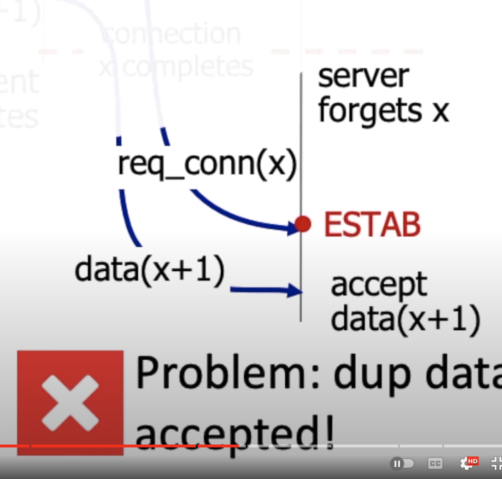
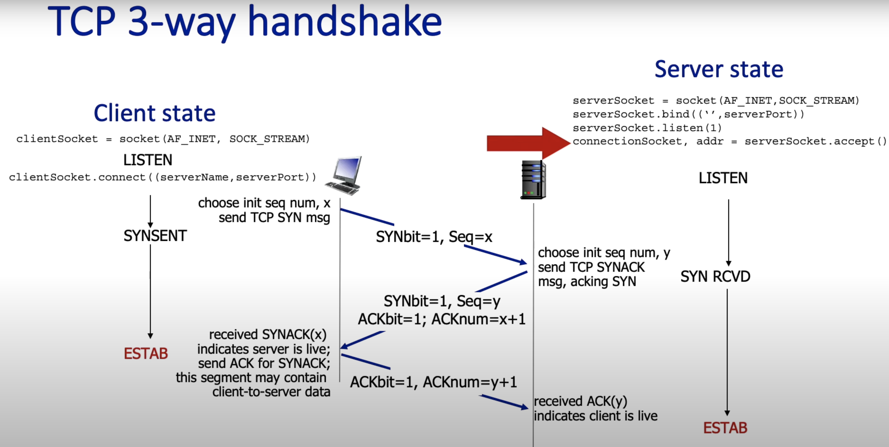

# The Transport Layer
## General Question
### Explain Multiplexing and Demultiplexing at TCP and UDP
- **Multiplexing at sender:** 
  - Handle data from multiple sockets
  - Add transport header (It will be later used for demultiplexing)

- **Demultiplexing at receiver:**
  - Use header info to deliver received segments to correct Socket.

- **Connectionless demultiplexing at UDP:**
  - when creating a datagram to send into UDP socket, must specify
    - destination IP address
    - destination port number
  - When receiving host receives UDP segment:
    - It checks the destination port in segment
    - directs UDP segment to socket with that port number.
  - if multiple clients sending request in the same port number,
  they all will be directed to the same socket at the receiving
  host. This is happening because demultiplexing only happens
  in UDP on the basis of the port number.

- **Connection-oriented demultiplexing in TCP:**
  - TCP socket identified by 4-tuple:
    - Source IP address
    - Source port number
    - Destination IP address
    - Destination port number
  
  - Demux: When demultiplexing happens, receiver uses all four value (4-tuple)
  to direct segment to appropriate socket.

  - server may support many simultaneous TCP sockets:
    - each socket identified by it's own 4-tuple
    - each socket associated with a different connecting client

  

We can see in the picture, even if the server send data into the same port
the port then is being multiplexed into different sockets.

## UDP Questions
### General Knowledge: UDP
- **UDP (User datagram protocol):**
  - UDP is a no frill protocol.
    - It provides multiplexing and demultiplexing for the Transport layer
    and that's about it.
    - Because it does not provide connection oriented services, it does not
    need control messages which keep it dramatically simpler than TCP.

So one might ask why we would need a transfer protocol without any
reliability. Well, here are some reasons:
#### Use cases for UDP:
1. No connection is needed which makes the RTT lower. As a result, it makes
it faster.
2. It's low overhead, so clients and services can handle multiple connections
simultaneously.
3. It's efficient in keeping the header size small.
4. It will not be forced down because of connection. It can be positive or
negative depending on the context.

#### UDP is suitable for:
- streaming multimedia apps which are loss tolerant and rate sensitive.
- DNS, which sends very small messages and sensitive to delay.
- SNMP (Simple network message protocol) which is another fast
transactional protocol.
- and most recently HTTP/3.0

#### UDP without reliability
Now one might ask HTTP needs reliability. How come UDP is used in there
- A layer of reliability is added in the application layer.
- It is used over TCP to be faster than TCP.

#### UDP in action
- **UDP sender actions:**
  - UDP receives a message from an application in the application layer.
  - It then adds the UDP header field. Combines it in a packet and
  passes it to the IP.
  - IP then does it's job and sends it to the network.
  
- **UDP receiver actions:**
  - On the receiver side, the IP layer removes it's header and passes the 
  message to the UDP side.
  - When it receives the UDP layer, the UDP checks the checksum. Whether
  the message has been corrupted or not. If the check passes the UDP
  extracts the application message and extracts it to the correct socket.

#### UDP segment Format
  

1. UDP has one source port and one destination port demultiplexing.
2. Followed by the length of the Entire segment.
3. It has the checksum
4. It also has a payload, which is a message from application.

#### Checksum
The purpose of the checksum is to detect errors

  

When checking the checksum:
- The UDP layer does not know about the digits. It is only sent the sum.
- If the sum is not correct to the mentioned sum, the UDP levels it as 
wrong data.
- UDP has no way to understand which digit has been changed. So when
it does not matches with the sum, receiver identifies this data as
bad and throws it out.

#### UDP checksum
- **Sender Side:**
  - UDP treats contents of the UDP segment asn 16-bit integer both
  the header and the body.
  - UDP adds them all up and then performing one's complement to it. It then
  puts it in the UDP's checksum field.
  
- **Receiver Side:**
  - The receiver then performs the same computation
  - It then checks the checksum to the checksum sender has sent
    - when it's not equal it considers it as error.
    - No error? The receiver has no way to identify which digit has been
    changed. Even though the errors are present, it still can pass.

#### Internet checksum as an example
  

1. The internet checksum method first takes the two 16-bit digits and
adds them up.
2. If there is a carry, then it's also been added to the summation.
3. Then one's complement will be performed.

  

Now internet checksum can be weak way to check the authenticity of data.
- Let's take one example
  - If we flip two digits in the earlier number
  - Then we also flip two digits in the next number
  - the whole sum stays the same even though the sum is the same
  - Hence, weak security.

## TCP Questions
### TCP segment structure
1. TCP has a source port and a destination port.
2. TCP has a 32-bit sequence number
3. TCP has a 32-bit acknowledgement number
4. TCP has an Internet checksum
5. TCP also has options which are not fixed. aka variable.
6. There is a field in the Header for flow control.
   (the number of bites it is willing to accept)
7. There are RST, SYN, FIN (R,S,F) bits are used for connection management.
   - **SYN(Synchronize):** This flag is used to initiate a TCP connection.
   When a device wants to start a TCP connection, it sends a segment
   with a SYN flag. The receiver responds with SYN-ACK if it's already
   ready to establish the connection.
   - **FIN (Finish):** This flag is used to gracefully close an established
   TCP connection. When a device is finished sending data and wants to 
   close the connection, it sends a segment with the FIN flag set.
   - **RST (Reset):** This flag is used to abruptly terminate a connection.
   It can be sent by a device if it receives a segment that is not expected,
   indicating an error or immediate stop of the connection. It’s also used 
   to reject an attempt to establish a connection
8. Two bits in the header for congestion notification (C, E).
9. There are 2 bits for urgent field, which are not used in practice.

### TCP: Sequence number and acknowledgement number
- **Sequence Number:** TCP implements byte stream abstraction.
  The sequence number carried in TCP segment header,`indicates the byte stream
  number of the first byte in the segments payload data.` Payload data is
  something that you send at last.
- **Acknowledgements:** The acknowledgement field is sent by the receiver to tell
  the sender the sequence of the next byte that's expected to be received from the
  sender. This number also serves as cumulative acknowledgement for all bytes of
  data before that sequence number.

  

- In the picture we can see that, the `sequence number` is always acknowledged
number of the previous connection
- The `acknowledgement number` in always sequence number of the previous
connection plus one.

### TCP: Flow Control
- Flow control is a mechanism to avoid the calamity of receiver being
overrun by sender by sending way to fast. It allows receiver explicitly
control the sender so that the sender does not transmit too much too 
fast.

- The receiver tells how much free buffer space there is, and the sender
will not send any more data than that. The limit that is set by the 
receiver is notated by `rwnd`.

- This information is sent to sender to receiver advertised window in the
TCP header, and the value will change as the free buffer fluctuates overtime.

### TCP: Connection Oriented
- TCP is connection oriented because there are many shared states between
the sender and the receiver.
  - In TCP both sender and receiver have to communicate on whether they
  want to communicate with each other or not.
  - There are connection parameters like sequence number and receiver
  advertised window. They both need to agree on that. It is agreed on
  so-called handshake protocol.

### TCP: 2-way handshakes do not work
- **1st scenario:**
  - The 1st scenario is client gives a request connection with sequence x
  and the server sends the acknowledgement x to the client.
  - The Client then sends data (x+1) to the client, and the server sends
  the acknowledgement (x+1), and the connection is complete.
  - Hence, No problem

  

- **2nd scenario:**
  - In the second scenario the client sends a connection request and
  the server accepts it and the connection x completes.
  - Now suppose, the client does not receive the accknowledgement back.
  Hence, it sends the connection request again and the server also returns
  the acknowledgement.
  - In this scenario, it has created a half-open connection.
  
    

- **3rd scenario:**
  - In the third scenario, the client terminates it's connection after
  establishing the connection and the server forgets about the request x.
  - Now just before the connection is closed by the client, it send
  connection request x again and also retransmits the data (x+1) again.
  - The server sees, the connection request and data sequence to be correct.
  - Now assume, this is a payment of subtraction 100 Euros for your account
  - It happened twice.
  - It's a duplicate request problem

  
  

### TCP: 3-way handshake
- The client and server both create a TCP socket and enters `LISTEN` state.
1. The client then sends sequence x to the server with SYNBit = 1.
2. The server sees the SYN message and enters the SYN RCVD `Scene Received`
state. Not established state. In return it sends the SYN ACK message back.
3. After getting the ACK message from the server, the client also sends a
ACK message to the server back.

  

Then the `SERVER and CLIENT` both enters the `ESTAB(established state)`

### TCP: Round Trip Time and Timeout
How to set TCP timeout?
- longer than RTT, but RTT varies! `That's a challenge.`
  - `too short`: If the timeout is too short, there will be unnecessary
    retransmission.
  - `too long`: If the timeout is too long, it will slowly react to
    the segment loss.

- `Estimated RTT = (1-alpha) * EstimatedRTT + alpha * sampleRTT`
  - It is also called `Exponential weighted moving average`
  - Influence of past sample decreases exponentially fast
  - Typical value: alpha = 0.125

  

- timeout interval: EstimatedRTT plus "safety margin"
  - large variation in `Estimated RTT`: want a larger safety margin
  - `TimeoutInterval = EstimatedRTT + 4*DevRTT`

- `DevRTT`: EWMA of `SampleRTT` deviation from `Estimated RTT:
  - `DevRTT = (1-ß) * DevRTT + ß * (Sample RTT - Estimated RTT)`

### Congestion Control
Informally, `too many resources sending too much data at too fast for
network too handle`

#### Causes of congestion
##### Ideal scenario: some perfect knowledge
  - Packets can be lost (dropped at routers) due to full buffers.
  - sender knows when a packet has been dropped: only resends packets when
  known to be lost.
  
  
  

When retransmission occurs due to know loss, the plot shows arrival rate
vs throughput, looks something like this:
- at low arrival rate, buffers will always be available, every originally
transmitted package will make it through. From the graph we can see that,
in the low-arrival region, the arrival rate including retransmission which
usually occurs not very often, eventually equals the receiver throughput.
- However, when the arrival rate is increased, and it gets close to R/2, can't
go any higher; the maximum throughput at the receiver is less than R/2.
- The rest of the throughout is lost due to "wasted" capacity due to
retransmission.

##### Realistic Scenario: un-needed duplicates
- packets can be lost, dropped at router due to full buffers—requiring
retransmission.
- But sender times can time out prematurely, sending two copies, both
of which are delivered.

  

- Since the user does not know about the retransmitted data, the sender
sends duplicate data.
- Hence, the maximum throughput drops even further.

#### Costs of congestion
- 'More work' (aka retransmission) is needed for given receiver throughput
- `unneeded retransmission:` link carries multiple copies of a packet.
  - decreasing maximum achievable throughput.

##### Multiple Router scenario
  

- In the above scenario, we can see that, if a packet wants to be
transmitted from `Host-A` to `Host-C`, it both needs to be transmitted
through two routers.
- If a packet transmits from 1st router and then lost in the 2nd router
it needs to be retransmitted again.
- Another way to look into it, if a packet successfully travels from
the first router successfully to be failed to be transmitted in the second
router, the throughput has been lost in the first router.

- Q. What happens if λ and λ(prime) increase?
- A. When λ and λ(prime) increase, from `HOST-A` and the throughput
increases from R/2, the second-hop(blue) router's packets are dropped.
Hence, blue throughput gets close to 0. So, it cannot get any worse
than 0 throughput.
- When packets dropped, any upstream transmission capacity used for
buffering used for the packet, will be lost.

### TCP: Congestion Control
- `Approach:` The principal of congestion control is:
  - Increase the sending rate until packet loss occurs.
  - Decrease the sending rate until loss of event happens.

#### TCP: AIMD (Adaptive Increase Multiplicative Decrease)
- The algorithm that controls the increase and decrease of the
of sending the packet rates is called `Additive Increase Multiplicative
Decrease (AIMD)`
  - `Additive Increase:` Increase sending rate by 1 maximum segment
  - `Multiplicate Decrease:` Cut sending rate half of each at loss
  segment.

  

1. There are segments that are acknowledged shown in `Green` mark.
2. The segments that have been sent but not yet acknowledged have been shown
in `Yellow` here.
3. There are segments that could be sent, congestion control algorithm would
allow this to be sent if they were data. They are marked by `Blue` color.
4. This `Blue` and `Yellow` are called congestion window.
5. The size of the window is controlled by `AIMD` window.

#### TCP: Congestion Control: Details
Now there is a direct relationship between the window size and TCP user's
sending rate.
- TCP rate: (cwnd/RTT) bytes/sec data. Means TCP sending this amount of data
per second.

##### TCP: CUBIC
`TCP CUBIC` works as follows:
1. `TCP CUBIC` uses a cubic function to grow the congestion window (cwnd), 
which determines how much data can be sent before waiting for an 
acknowledgment. After a packet loss (which signals congestion), CUBIC 
resets the cwnd and then begins to grow it again following a cubic curve.
2. The window size under CUBIC grows quickly after a packet loss but slows 
down as it approaches the previous maximum window size before the loss. 
This behavior allows for rapid recovery while avoiding sudden congestion.

More specifically:
- K: point in time when TCP window size will reach W(max)
  - K itself is Tunable
- increase W as a function of the `cube` of the distance between current
time and K
  - larger increase when further away from K
  - smaller increase when near to K

- `TCP cubic is the most widely used congestion control algorithm.

#### TCP: the congested "Bottleneck Link"
- We have seen in the `AIMD, and CUBIC` TCP increase it's sending rate
until packet loss occurs.
- Now packet loss occurs at some router's output: It is also called `the
Bottleneck`

#### Delay-based congestion control
AIMD would fill the buffer's bottleneck link until loss occurs. Now let's
think what will happen if the bottleneck link is congested.
- If the bottleneck link is always busy, there is no point increasing
the user's sending rate.
- Router can only deliver R/bits per second on the congested output link.
- If the TCP sender sends faster, it still cannot deliver more than R/bits
per second.
- So we want to keep the router busy, but not too much busy as it starts to 
a loose packet.
- That is the insight

Here is short brief how delay-based congestion control works:
- measured throughput = (# bytes sent in last RTT interval / RTT(measured))
- RTT(min)—minimum observed RTT(uncongested RTT)
- uncongested throughput with congestion window cwnd/RTT(min) `(This is the
throughput with no congestion)`
  - If measured throughput `very close` to uncongested throughput
  - Means in current throughput, we are absolutely sure that
  there will be no congestion.
    - increase `cwnd` linearly
  - Else if measure throughput `far below` to uncongested throughput
  - Means, current throughput is very close to congestion
    - decrease `cwnd` linearly

#### Explicit congestion notification
- **Purpose of ECN**:
   - ECN allows end-to-end notification of network congestion **without 
  dropping packets**. Unlike traditional congestion control methods that 
  rely on packet drops to signal congestion, ECN provides a more efficient 
  way to handle congestion.
  - When congestion occurs, the receiver echoes this congestion indication back
  to the sender, which then reduces its transmission rate as if it detected
  a dropped packet.

- **Implementation Details**:
  - ECN uses two bits in both the TCP header and the IP header.
  - The two bits are **CWR (Congestion Window Reduced)** and **ECE (ECN-Echo)**.
  - When congestion is detected, the router sets the ECN field within an IP 
packet to **CE (Congestion Experienced)**.
  - The receiver echoes this indication to the sender by setting proper bits 
in the transport protocol header.
  - ECN avoids retransmissions, making it particularly useful for time-sensitive 
packets.

### Closing TCP connection
Closing a TCP connection is a four-step process, often referred to as the 
four-way handshake. Here's how it works step by step:

1. **FIN from the Client:** The client decides to close the connection and 
sends a FIN (finish) segment to the server. This tells the server that the 
client has finished sending data, but can still receive data from the server.

2. **ACK from the Server:** Upon receiving the FIN segment, the server sends
back an ACK (acknowledgment) segment to the client. The server then enters 
a CLOSE_WAIT state, indicating it has received the client's request to close
the connection but may still need to send its own data.

3. **FIN from the Server:** Once the server has finished sending its 
remaining data, it sends its own FIN segment to the client to signal that 
it has finished sending data.

4. **ACK from the Client:** The client responds with an ACK to the server's
FIN segment. After this step, the client enters a TIME_WAIT state to ensure
the server's ACK was received and to wait for any packets that may have been
delayed in the network. The server, upon receiving the final ACK, closes 
the connection.

## Other Questions
### Some well-known Ports
- **HTTP 80:** Port 80 is the default port for Hypertext Transfer Protocol 
(HTTP), which is used for unencrypted web traffic. When you access a website
with `http://`, it uses port 80.

- **HTTPS 443:** Port 443 is used for HTTP Secure (HTTPS). It's the default 
port for websites that use SSL/TLS encryption. When you visit a website with
`https://`, it uses port 443 to secure the communication.

- **FTP 21:** Port 21 is used for File Transfer Protocol (FTP) control 
(commands). FTP is a standard network protocol used for the transfer of 
computer files between a client and server on a computer network.

- **SMTP 25:** Port 25 is used for Simple Mail Transfer Protocol (SMTP), 
which is the standard protocol for sending emails across the Internet.

- **IPSec 500:** Port 500 is used by Internet Protocol Security (IPSec). 
It's primarily used for establishing mutual authentication and negotiating 
cryptographic keys for VPN connections.