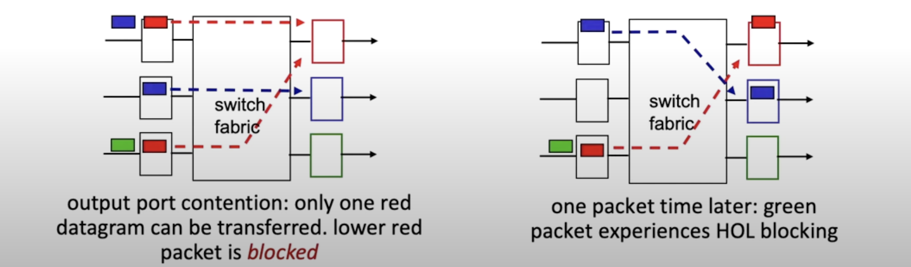
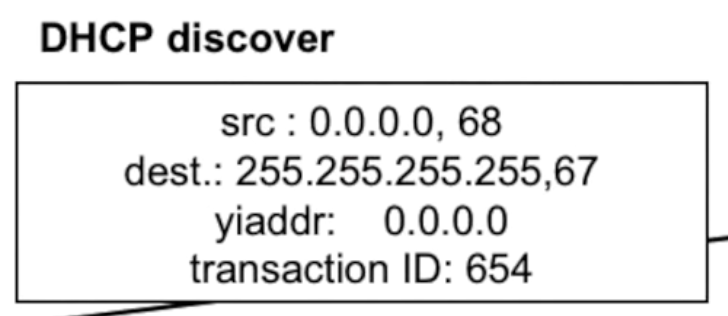
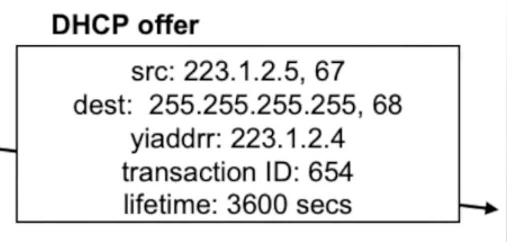

# The Network Layer: The Data Plane
### Data Plane Vs Control Plane
- **Focus and Functions**:
  - **Control Plane:** Manages and controls the network, defines how data 
  packets should be transmitted.
  - **Data Plane:** Physically moves data based on control plane decisions.
- **Protocols Used**:
  - **Control Plane:** Utilizes protocols like OSPF, BGP, and others.
  - **Data Plane:** Uses protocols like Internet Protocol (IP) and Ethernet.

### Pre-Router Control Plane
Pre-Router control refers to an approach where each router within 
a network has its own dedicated control plane.

- Inside every router there is a local forwarding table. The router operates
by matching bits with the datagram header with a table entry in the forwarding
table that specifies the appropriate output link to which datagram it should
be forwarded.

Now the main question is how this networking table is computed?
- In the earlier days, forwarding table used to be hand computed.
- Nowadays, forwarding tables are computed rather than hand configured.
- Now how they are computed is the difference between the routing approach
and software defined approach.
- In the traditional routing approach mentioned here, a distributed 
routing algorithm is present in every router. Means, a piece of the algorithm
is present in every router.

### Software-Defined Networking(SDN) control plane
In SDN, there is a remote control software that computes 
and distributes the forwarding table to use by each and every router under
its control.

- The router still performs the local forwarding, but the forwarding table
is received from the SDN. Unlike a Pre-Router Control Plane where it computes
by itself.

### Router Architecture
- The Router has some inputs and outputs. Here is where Physical layer and link layers
are implemented. Ethernet mostly implements Link layers. Key parts of the
network layers are also implemented in the inputs and outputs port.
- The Number of ports in a router can vary a lot. From 5 to 10 for home router to
Hundreds of ports on an industrial level router.
- Packets are moved from input port to output port using switching technique.
- This is actually the heart of the router. This is also a network within
a network.
- Router also has a routing processor. Which controls plane function, controls
switch fabric, and also control the forwarding table.
- As you can see from the figure, router components also can be devided into
two parts. 
  - The Control Plane
  - The Data Plane

  

### Input port functions
- **The line termination function:** This part is responsible for receiving
bit level transmission for receiving over the physical medium which is copper,
fiber or wireless. 
- **Link Layer:** Then there are link level functions, where bits are 
assembled in link layer frame. Like Ethernet.
- **Network layer function:** Finally, there are network layer functions here.
Packet ques may form here.
  - The most important part of the input port is to look up and forwarding
  functions. Determining the output port. To which port it will be forwarded.

  

This look up and forwarding is match plus action behavior. There are two
types of forwarding:
1. **Destination-based forwarding:** forward only based on destination
IP address (traditional).
2. **Generalized forwarding:** Forward based on any set of header field
values.

  

As from the table, we can see certain ranges has been booked. But what 
happens if the ranges intercept?

### Longest prefix matching
- Longest Prefix Matching (also known as Maximum Prefix Length Match) is an
algorithm used by routers in Internet Protocol (IP) networking to select 
an entry from a routing table.
#### How does Longest Prefix Matching work
- When a router receives an IP packet, it compares the destination IP 
address bit-by-bit with the prefixes in its routing table.
- The router selects the prefix with the most matching bits as the one to 
use for forwarding.
- Essentially, it prefers the longest prefix (i.e., the most specific prefix) 
that matches the destination IP address.

#### Examples of Longest Prefix Matching
1. **Example 1**:
  - Imagine the router receives an IP packet with the destination address 
**192.168.2.82**.
  - In binary, the IP address looks like this:
    - Destination IP address (binary): **11000000.10101000.00000010
    .01010010**
  - The router has the following prefixes in its routing table:
    - **192.168.2.80/29** (binary: **11000000.10101000.00000010.01010000**)
    - **192.168.2.64/27** (binary: **11000000.10101000.00000010.01000000**)
    - **192.168.2.0/24** (binary: **11000000.10101000.00000010.00000000**)
    - All of the prefixes above match our destination IP address. However, 
    if we compare the bits, we find that **192.168.2.80/29** matches the most 
    bits with IP address **192.168.2.82**. Therefore, this is our **“longest 
    prefix”** for this destination.

2. **Example 2**:
  - Now, consider an IP packet with the destination address **10.4.1.62**.
  - In binary, the IP address looks like this:
    - Destination IP address (binary): **00001010.00000100.00000001.00111110**
  - The router's routing table includes these prefixes:
    - **10.4.1.32/27** (binary: **00001010.00000100.00000001.00100000**)
    - **10.4.1.0/24** (binary: **00001010.00000100.00000001.00000000**)
    - **10.0.0.0/8** (binary: **00001010.00000000.00000000.00000000**)
  - Among these, **10.4.1.32/27** is the closest match to the destination 
IP address.

- Longest Prefix Matching often performed in `Ternary content addressable
memories (TCAM)`
  - Matching with prefix and retrieving the proper addressing table is done
  within one clock cycle.

### Switching Fabric
Switching Fabric is on the very heart of the router. Its job is to switch
packets from the input side to the output side of the switching fabric.
In other words, its job is to move packets from input port to output port
that has been determined by the longest prefix match.

- **Switching Fabric:** One of the most important fabric of switching is 
the switching rate. It is the rate at which packets can be transferred
from inputs to outputs.

**Three major types of switching fabrics:**
1. Memory:
   - The first routers were traditionally computers.
   - So the Switching between the input and output ports was direct
   control of CPU. It was a sort of routing processor.
   - The input port and output ports were operated as traditional IO
   devices in a traditional operating system.
   - The input port with an arriving packet will signal the CPU via
   interrupt. So that, the packet could be buffered from input to
   the processor memory.
   - The CPU will look for the appropiate port in the forwarding table
   - And write that content into the output buffer.
2. Bus:
   - Rather than taking a packet from input port to memory and from memory
   to output port, switching via BUS switches that intermediary and allows
   an input packet to directly write the output port buffer.
   - In this case the switching speed is limited to BUS bandwidth.
3. Interconnection network: This part is the most used switching fabric.
   - In the interconnection network, there are crossbar switches which 
   connect us from N input to N output.
   - Multi-stage switching networks are used
   - These multi-stage switch networks are made up by interconnecting smaller
   size switch elements both serially with multiple linear stages and in
   parallel across a given stage.
   - Fragment datagram into fixed length cells on entry.
   - switch cells through the fabric, reassemble datagram at exit.
   - As we have learned, parallelism can be exploited to build high
   performant switches such as a single router can habe 100's of Tbps
   bandwidth.

### Input port queuing
- When multiple input ports send packets to the same output port 
simultaneously, we need to deal with the fact that the input arrival rate 
is higher than the output departure rate. 
- This phenomenon is also named as, Head of the line blocking. HOL occurs
when packets from different input ports want to go the same output port.

  

### Output port queuing
- In output, bits can arrive in the N*R rate to the switch fabric, but the
bits can only be drained or transmitted out at the rate of R.
- When the arrival rate exceeds the departure rate, the buffer will fail, since
the buffers are finite; there may not be enough buffer space. Hence,
there can be packet loss.
- It's right at the output port where packet loss occurs.
  - Since there is finite buffer space, we need to drop some packets.
  If we are dropping some packets, we need to figure out a `DROP POLICY`
  on which packets to drop.
  - As there will be many packets in the buffer, we also need to figure
  out to which packet should be prioritized more than the others. We can
  call it, `Schedule Decipline`.

### Packet Scheduling
#### First come first serve (FCFS)
- In FCFS, packets are transmitted in the order they arrive to the output
port. 
- It is also known as First in first out.

#### Priority
- Priority scheduling works as the name suggests.
- In the priority scheduling, packets arriving in the output queue are
classified in priority classes.
- The priority queue discipline will transmit a packet from the highest
priority class that has a non-empty queue. That is packet waiting for
transmission in the same priority class are typically done, in first come
first serve manner.
- Now one might ask how the priority classes are decided. It mostly
depends on the ISP.

#### Round Robin Scheduling
- Round Robin works almost as Priority scheduling
- When a packet arrives at the output buffer, it also classifies the packets
into different priority classes.
- In the round bin, servers cyclically scan different classes. For example,
RR will transmit a packet from priority class A, then B and then C. Say
priority class B has no packets queuing, RR will go scanning from A to C.

#### Weighted Fair Queuing
- WFQ is a generalized version of Round Robin.
- WFQ schedule serving classes in Round Robin manner. Say there are three
classes. First serving class 1, then serving class 2 and then serving class 3.
Repeating the service manner.
- Say an output has R throughput. In WFQ, a specific priority class will
receive at least `W(i)*R` throughput. 
- WFQ allows some type of bandwidth to be made on a per-class basis.

### Network Neutrality
Network neutrality, often referred to as net neutrality, is the principle 
that Internet service providers (ISPs) must treat all Internet 
communications equally. Some `clear and bright line rules are` -
- **No Blocking:** The ISP cannot block lawful content, applications and
services or non-harmful devices, subject to reasonable network management.
- **No Throttling:** Shall not impair or degrade lawful Internet traffic on
the basis of Internet Content, application or service.
- **No Paid Prioritization:** Shall not engage in paid prioritization.

### IPV4 Datagram
  

1. **Version Number**:
    - The first **4 bits** specify the IP protocol version of the datagram. 
   For IPv4, this value is set to **4**.
    - Different IP versions (such as IPv6) have distinct datagram formats.
    - The version number helps routers interpret the rest of the IP datagram.

2. **Header Length**:
    - These next **4 bits** determine where the actual data begins within 
   the IP datagram.
    - Since IPv4 datagrams can include variable-length options, this field 
   specifies the start of the data.
    - Most typical IPv4 datagrams have a **20-byte header**.

3. **Type of Service (TOS)**:
    - The TOS bits allow differentiation between various types of IP 
   datagrams.
    - For example, real-time datagrams (used by IP telephony) can be 
   distinguished from non-real-time traffic (like FTP).
    - The specific level of service is determined by the router's 
   administrator.

4. **Datagram Length**:
    - This field represents the total length of the IP datagram (including 
   both header and data), measured in **bytes**.
    - It is a **16-bit** value, allowing a theoretical maximum size of 
   **65,535 bytes**.
    - However, actual datagrams are rarely larger than **1,500 bytes**.

5. **Identifier, Flags, and Fragmentation Offset**:
    - These three fields relate to **IP fragmentation**:
        - **Identifier**: Helps reassemble fragmented datagrams.
        - **Flags**: Indicate whether fragmentation is needed or if more 
      fragments follow.
        - **Fragmentation Offset**: Specifies the position of each 
      fragment within the original datagram.

6. **Time-to-Live (TTL)**:
    - The TTL field ensures that datagrams do not circulate indefinitely 
   due to routing loops.
    - Each router decrements the TTL by one; if it reaches **0**, the 
   datagram is dropped.

7. **Protocol**:
    - Used only at the final destination.
    - Indicates the specific transport-layer protocol to which the data 
   portion of the IP datagram should be passed.
    - For example, a value of **6** indicates TCP, while **17** indicates 
   UDP.

### Classful IP addressing
**Classful IP addressing** is a method of **IP address allocation** in 
which IP addresses are divided into predefined classes. These classes are 
designated by the first few bits of the IP address, determining both the 
network and host portions of the address. Let's explore the details of 
class addressing:

1. **Class Divisions**:
    - Classful addressing divides the **IPv4 address space** (ranging from **0.0.0.0** 
   to **255.255.255.255**) into five classes: **A, B, C, D, and E**.
    - However, only classes **A, B, and C** are used for network hosts:
        - **Class A**: Suitable for very large networks. The network ID is 
      **8 bits** long, and the host ID is **24 bits** long. The first 
      octet's higher-order bit is always set to **0**. The default subnet 
      mask for Class A is **255.x.x.x**.
        - **Class B**: Assigned to medium-sized to large-sized networks. 
      The network ID is **16 bits** long, and the host ID is also **16 
      bits** long. The first octet's higher-order bits are always set to 
      **10**. The default subnet mask for Class B is **255.255.x.x**.
        - **Class C**: Suitable for small networks. The network ID is 
      **24 bits** long, and the host ID is **8 bits** long. The first 
      octet's higher-order bits are always set to **110**. The default 
      subnet mask for Class C is **255.255.255.x**.

2. **Class D and E**:
    - **Class D** (IP address range: **224.0.0.0 - 239.255.255.255**) is 
   reserved for **multicast** purposes.
    - **Class E** (IP address range: **240.0.0.0 - 255.255.255.255**) is 
   reserved for **future use**.

### Subnet
A **subnet**, or **subnetwork**, is a logical subdivision of an IP network. 
Here's how it works:

- **Purpose**: Subnetting makes networks more efficient by dividing a 
larger network into smaller segments.
- **Addressing Within Subnets**:
    - Computers within the same subnet share an identical group of the 
  most significant bits of their IP addresses.
    - This logical division results in two fields:
        - **Network Number (Routing Prefix)**: The part that indicates the
      network.
        - **Host Identifier**: The part that specifies a specific device 
      within that network.
    - For example:
        - The prefix **198.51.100.0/24** has a subnet mask of 
      **255.255.255.0**.
        - Addresses from **198.51.100.0** to **198.51.100.255** belong 
      to this subnet.

- **Routing and Efficiency**:
    - Traffic between subnets is routed through routers.
    - Subnetting ensures that packets take a direct route to their 
  destination without unnecessary detours.

### CIDR (Classless Inter Domain Routing) Address
- **CIDR** is a method of representing IP addresses and their associated 
subnet masks in a more flexible and concise way.
- In CIDR notation, an IP address is followed by a **slash (/)** and a 
number (e.g., **192.168.0.0/24**).
- The number after the slash represents the **prefix length** (also known 
as the **subnet mask length**), indicating how many bits are used for the 
network portion of the address.

### How CIDR Is Used for Subnetting:
Subnetting using CIDR involves borrowing bits from the host portion of 
the IP address to create smaller subnets. The number of bits borrowed 
determines the number of available subnets and the number of hosts per 
subnet. For example:

- Determine the number of bits needed to represent the required number of 
subnets.
  - We need to create 4 subnets, which requires 2 bits (2^2 = 4).
  
- Subtract the number of subnet bits from the total number of bits in the 
IP address to find out how many bits will remain for host addressing in 
each subnet.
  - Total bits: 32 (IPv4 address length)
  - Subnet bits: 2 (as we borrowed 2 bits for subnetting)
  - Host bits: 32 - 2 = 30 bits for host addressing in each subnet
- Calculate the new subnet mask.
  - The default subnet mask for a /24 network is 255.255.255.0.
  - To create 4 subnets, we borrow 2 bits, so the new subnet mask will have 
  two more bits set to 1. These bits represent the subnet portion.
  - In binary, the subnet mask becomes 11111111.11111111.11111111.11000000, 
  which translates to 255.255.255.192 in decimal notation (/26).
  
- Determine the ranges for the four subnets.
  - Since we've borrowed 2 bits for subnetting, the subnet ranges will 
  increment in multiples of 64 (2^6 = 64), as the last 6 bits 
  (from 26 to 32) will represent host addresses within each subnet.
  - Subnet 1: 192.168.1.0/26 (Range: 192.168.1.0 - 192.168.1.63)
  - Subnet 2: 192.168.1.64/26 (Range: 192.168.1.64 - 192.168.1.127)
  - Subnet 3: 192.168.1.128/26 (Range: 192.168.1.128 - 192.168.1.191)
  - Subnet 4: 192.168.1.192/26 (Range: 192.168.1.192 - 192.168.1.255)

- P.S: In Every subnetwork, 2-bits are reserved for network address and
broadcast address.

### DHCP client-server handshake
- **STEP-1** In the first step, the arriving client broadcasts a DHCP message which will
be received on the interfaces on all of the hosts and routers in the subnet
that it is attaching.
  - The discovery message basically says, is there a DHCP message out
  there? This is a form of service discovery. The host the service it
  needs, DHCP. So it sends out the message to broadcast to discover the
  server that can provide DHCP service.
  - DHCP runs over UDP. The client uses port 68, and the server will use
  port 67.
  - In other words, the server will be listening to port 67 for incoming
  DHCP messages.
  -   
    - From the picture we can see, the source has an IP address of 0.0.0.0
    with port 68.
    - The destination has an IP address of 255.255.255.255 with port 67.
    - The discovery message also has a transaction ID: 654
    - This transaction ID is necessary as the DHCP server will also
    respond to the subsequent message with this transaction ID.
    
- **STEP-2:** Then the DHCP server replies with offer message. The response
is sort of like, `Hey I am a DHCP server and here is the IP address you can
use.`
  -   
    - The DHCP offer message comes from 223.1.2.5 and from port 67.
    - The offer message has been broadcast on all interfaces on the
    subnet which is notated by 255.255.255.255 destination server.
    - The DHCP message contains the IP address (223.1.2.4) which the requesting host
    can use.
    - The lifetime of this IP address is 3600sec.
    - Note that, the transaction ID matches the transaction ID of the
    initial offer message.
    
- **STEP-3:** Now step two mentioned above could be optional.
    - Now the client comes with his own IP address which he may get from
  the previous request.
    - It contains the IP address the HOST is proposing to use.
    - Also, the lifetime it wants to have
- **STEP-4:** The final message is the ACK message from the server saying
    that you can use the IP address for the given lifetime.

#### Static vs DHCP Routing
**Static IP Addressing**:
- Involves manually assigning a fixed IP address to a device.
- The IP address does not change even if the device reboots.
- It's typically used for servers hosting websites, email, VPN, and FTP 
services.
- Each device has its own address with no overlap, and network 
administrators must avoid using the same IP address again.
- Requires manual configuration of the IP address, subnet mask, default 
gateway, and DNS server.

**DHCP**:
- A protocol for assigning dynamic IP addresses to devices on a network.
- The IP address can change when the device reconnects to the network.
- Simplifies the process of connecting new devices to a network as the 
DHCP server automatically provides the IP address, subnet mask, default 
gateway, and DNS server.
- Useful in environments with a large number of transient devices, like 
Wi-Fi hotspots or BYOD workplaces.

### Private vs Public IP address
| Feature | Public IP Address | Private IP Address |
|---------|-------------------|--------------------|
| **Definition** | An IP address used to communicate outside the network, assigned by the ISP. | An IP address used to communicate within the same network, usually assigned by the router. |
| **Assignment** | Provided by an Internet Service Provider (ISP). | Assigned by a local network's router to devices within its network. |
| **Types** | Can be Dynamic (changes over time) or Static (permanent). | Unique within the local network but can be reused in different networks. |
| **Visibility** | Visible on the Internet, can be traced back to the ISP. | Only visible within the local network, not on the Internet. |
| **Security** | Subject to attacks, additional security measures needed. | More secure, as it's not exposed directly to the Internet. |
| **Usage** | Used for communication over the Internet. | Used for communication within a private network. |
| **Example Range** | 1.0.0.0 to 223.255.255.255. | 10.0.0.0 to 10.255.255.255, 172.16.0.0 to 172.31.255.255, 192.168.0.0 to 192.168.255.255. |

### NAT (Network Address Translation)
Network Address Translation (NAT) is a network protocol used to modify network 
address information in the IP header of packets while they are in transit across 
a traffic routing device. Here's a brief overview of NAT:

- **Purpose**: NAT was originally designed to extend the life of IPv4 by 
conserving the limited number of available public IP addresses. It allows 
multiple devices on a local network to share a single public IP 
address when accessing the internet.

- **Function**: It translates the private IP addresses of devices within a 
local network to a public IP address and vice versa. This process happens as 
the data packets move between the network and the internet.

- **Benefits**: NAT helps maintain privacy of the internal network and can aid 
in network security by keeping internal IP addresses hidden from the external 
network.

### How does NAT work?
  

1. Host 10.0.0.1 from port 3345 sends datagram to 128.119.40.186
in the port 80. 
2. Datagram then reaches the router which then changes the source
IP address from 10.0.0.1, port number 3345 to 138.76.29.7, port
number 5001.
3. Then the remote host replied. Note that the reply arrived 138.76.29.7, 
port number 5001 in the NAT router.
4. Using the destination IP address, the router then looks into the
forwarding table. Then it replaces the destination IP address with
the local IP address. After replacing the datagram, it forwards
the datagram to the device connected to the local network.

### IPV6
#### Reason of IPV6
IPv6 is essential because it addresses the limitation of IPv4 in terms 
of address space. IPv4, which uses a 32-bit addressing scheme, can support 
approximately **4.3 billion devices**. With the exponential growth of the 
internet and the number of devices connected to it, this number of addresses
is not sufficient. IPv6, with its 128-bit addressing, can support about 
**340 undecillion IP addresses**, which is a virtually inexhaustible supply 
for the foreseeable future.

IPv6 also brings several improvements over IPv4, such as:
- **Efficient packet handling**: IPv6 can handle packets more efficiently, 
improve performance, and increase security.
- **Hierarchical addressing**: This allows internet service providers to 
reduce the size of their routing tables, making the internet more scalable.
- **Enhanced security**: IPv6 was designed with internet security in mind, 
including features that are optional in IPv4.

#### Public IP and Private IP in IPV6.
- **Public IPv6 Address**: These are globally unique and accessible from 
anywhere on the internet. They are typically assigned to devices like 
servers that need to be directly accessible from the internet.
- **Private IPv6 Address**: These addresses are local to a specific link 
or site and are not routed outside a particular network. They are 
similar to the private IPv4 addresses used within local networks (LANs). 
Private IPv6 addresses can be further divided into:
    - **Site-local addresses**: Used within an entire site or organization.
    - **Link-local addresses**: Used on a single network segment or link 
  and are not routable outside of that link.

### IPV6 Datagram format
  

- **Version (4 bits)**: Indicates the version of the Internet Protocol 
used, which is 6 for IPv6.
- **Traffic Class (8 bits)**: Used to differentiate between packets with 
different priorities and types of service.
- **Flow Label (20 bits)**: Used to label packets belonging to the same 
flow, allowing for special handling by routers.
- **Payload Length (16 bits)**: Specifies the size of the payload, 
including any extension headers.
- **Next Header (8 bits)**: Identifies the type of header immediately 
following the IPv6 header.
- **Hop Limit (8 bits)**: Replaces the Time to Live (TTL) field from 
IPv4, indicating the maximum number of hops allowed for the packet.
- **Source Address (128 bits)**: The IP address of the sending node.
- **Destination Address (128 bits)**: The IP address of the receiving 
node.

### Transitioning from IPV4 to IPV6
- The transition from IPV4 to IPV6 turned out to be not so easy to
implement.
- The best methodology is to IPV4 and IPV6 coexist.
- The key to IPV4 and IP6 to coexist together is **tunneling**.
- Let's say there are two Routers connected with each other via IPV4
network. They both can do IPV4 and IPV6.
- The process is to put IPV6 datagram into IPV4 payload. This process
is called tunneling.

#### Example of tunneling
- We have a multiple router situation.
  - Router A and F only support IPV6.
  - Router B and E support IPV4 and IPV6.
  - Router C and D only support IPV4.

- A's forwarding table says, A's next hop is router B. Hence, it is
forwarded to B. Please note, in the source it says the source address is
A, and the destination address is F. The flow is X, which only exists
in IPV6.
- When the packet arrives in router B, it looks in it's forwarding table
and sees the next hop router is router E. Now, it sees that both routers
B and E are connected via IPV4.
  - As a matter of fact, in the forwarding table it will be written,
   to get to router F, forward this packet to router E's IPV4 tunnel.
  - Hence, it creates an IPV4 datagram, sends it to E while putting IPV6's
  datagram into its payload. Then it forwards its datagram to the
  tunnel.
- Then the IPV4 datagram is forwarded from B to E with the mechanism
we already knew before.
- When the packet arrives router E, it sees the packet is meant for him
  - Now, then it looks inside the packet and sees, the IPV6 datagram
  into its payload.
  - After seeing the IPV6 datagram, it sees that is it meant for router
  F. It then looks into its forwarding table, and then forwards the
  table to F.

  

### IPv4 vs IPv6
- **Address Size**:
    - IPv4 addresses are **32-bit** long, allowing for about 4.3 billion 
  unique addresses.
    - IPv6 addresses are **128-bit** long, which supports a vastly larger 
  number of addresses, enough for every grain of sand on Earth to have its 
  own address!

- **Address Notation**:
    - IPv4 addresses are written in **dotted-decimal format** 
  (e.g., 192.168.1.1).
    - IPv6 addresses use **hexadecimal notation**, separated by colons 
  (e.g., 2001:0db8:85a3:0000:0000:8a2e:0370:7334).

- **Address Configuration**:
    - IPv4 often requires manual configuration or DHCP (Dynamic Host 
  Configuration Protocol).
    - IPv6 supports **auto-configuration** and **renumbering**.

- **Packet Handling**:
    - IPv4 headers are more complex and can vary in length.
    - IPv6 headers have a **simplified** and **fixed-length header**, 
  which improves efficiency.

- **Security**:
    - IPv4 was not designed with security in mind, so it relies on 
  applications like **IPSec** for security.
    - IPv6 has **security features built-in**, including IPSec support, 
  which is mandatory.

- **Network Address Translation (NAT):**
  - IPv4 often requires NAT due to the limited number of public 
  IP addresses.
  - IPv6 eliminates the need for NAT, allowing for end-to-end connectivity 
  at the IP layer.

### IPV6 Dropped Features
- **Checksum**: IPv6 has **dropped the header checksum**. In IPv4, each 
packet includes a checksum for error-checking of the header. IPv6 omits 
this because most link-layer technologies already contain checksum and 
error-control capabilities, making an additional checksum at the IP layer 
redundant and a waste of processing power.

- **Fragmentation**: In IPv4, routers can fragment packets if they are too 
large for the next hop. IPv6 **removes the fragmentation feature** from 
routers, placing the responsibility for packet fragmentation on the 
originating node (the sender). This change reduces the complexity and 
processing load on routers, improving overall network efficiency.

- **Options**: IPv4 includes an options field in the header, which can be 
used for various purposes but also complicates header processing. IPv6 
**replaces the options field** with **Extension Headers**. These headers 
are optional and are placed between the IPv6 header and the payload; they 
are used only when necessary, which simplifies and speeds up the routing 
process because most packets don't contain them.

### Flow table abstraction
Flow table abstraction refers to the simplification of 
the complex process of packet-forwarding decisions into a set of rules 
known as flow entries. These flow entries are stored in a flow table 
within a network switch or router.

#### Match plus action
- **Match:** This part involves checking the incoming network packets against 
predefined criteria in the flow table. The criteria can include various 
packet fields such as source and destination IP addresses, TCP/UDP ports, 
and more. If a packet’s header information matches the criteria, then the 
corresponding action is taken.

- **Action:** If there’s a match, the action part defines what to do with the 
packet. Actions can include forwarding the packet to a specific port, 
modifying the packet header, dropping the packet, or sending it to the 
SDN controller for further processing.

### Open Flow
OpenFlow is a protocol that allows a network controller to interact directly 
with the forwarding plane of network devices such as switches and routers, 
both physical and virtual (hypervisor-based). 

1. When the first packet from Host A arrives at the switch, the switch doesn't 
know what to do with it, so it sends the packet to the SDN(Software Designed
Network) controller.
2. The controller uses its network-wide view to decide the best path for the 
packet. It then installs a flow entry in the switch's flow table, telling it 
how to handle such packets.
3. The flow entry might say, "All packets from Host A to Host B with a 
specific header pattern should be forwarded through port 3."
4. The switch then processes the packet according to this rule and forwards 
all subsequent similar packets without contacting the controller.

### Architectural Principal of Internet
There are three cornerstone beliefs of the Internet:
1. Simple Connectivity
2. IP Protocol: The narrow waist
3. Intelligence, complexity at the network's edge.