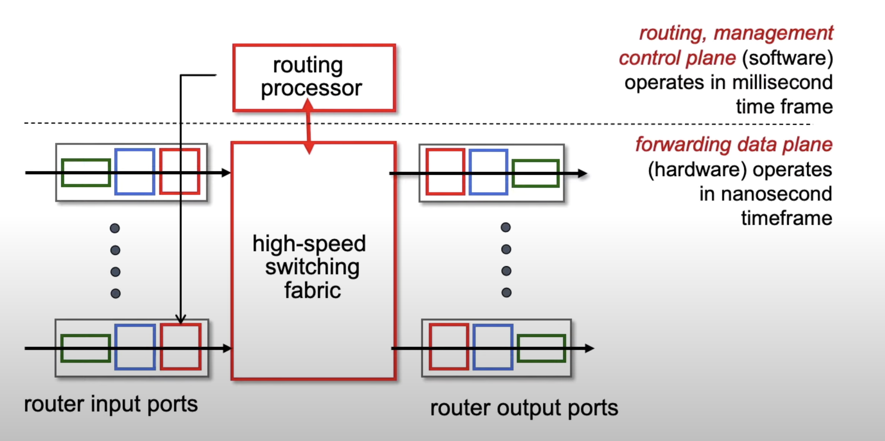
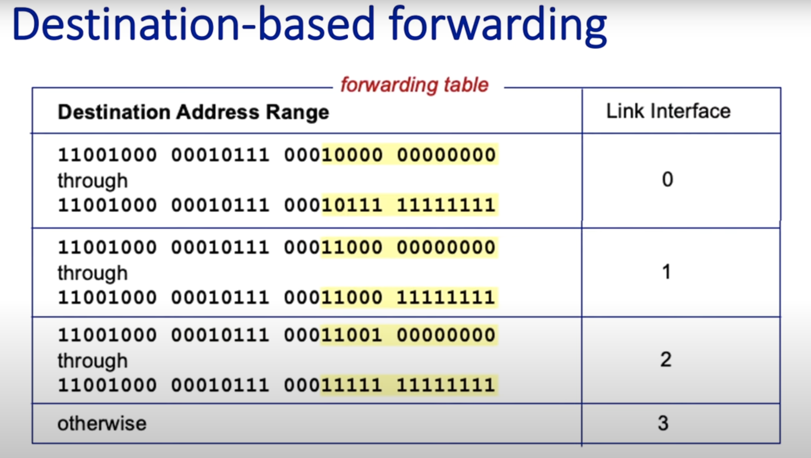
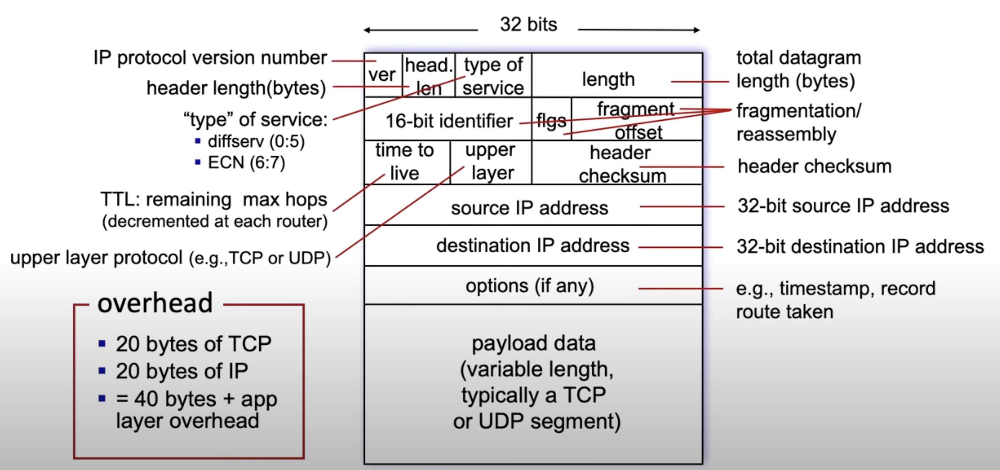
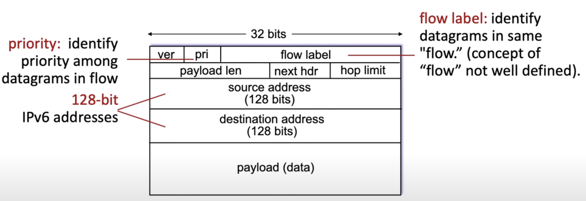
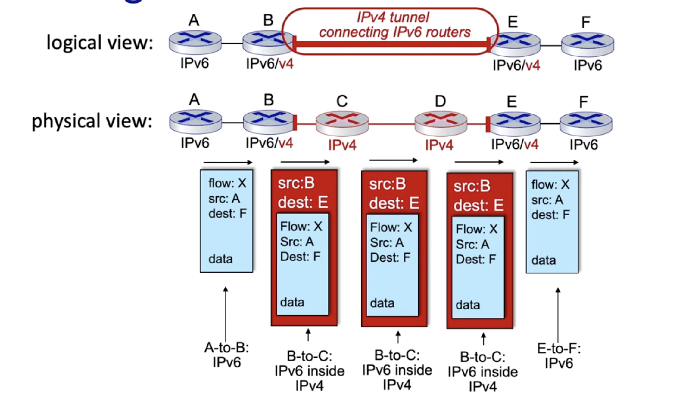

# The Network Layer: The Data Plane
### Data Plane Vs Control Plane
- **Focus and Functions**:
  - **Control Plane:** Manages and controls the network, defines how data 
  packets should be transmitted.
  - **Data Plane:** Physically moves data based on control plane decisions.
- **Protocols Used**:
  - **Control Plane:** Utilizes protocols like OSPF, BGP, and others.
  - **Data Plane:** Uses protocols like Internet Protocol (IP) and Ethernet.

### Per-Router Control Plane
Per-Router control refers to an approach where each router within 
a network has its own dedicated control plane.

- Inside every router there is a local forwarding table. The router operates
by matching bits with the datagram header with a table entry in the forwarding
table that specifies the appropriate output link to which datagram it should
be forwarded.

Now the main question is how this networking table is computed?
- In the earlier days, forwarding table used to be hand computed.
- Nowadays, forwarding tables are computed rather than hand configured.
- Now how they are computed is the difference between the routing approach
and software defined approach.
- In the traditional routing approach mentioned here, a distributed 
routing algorithm is present in every router. Means, a piece of the algorithm
is present in every router.

### Software-Defined Networking(SDN) control plane
In SDN, there is a remote control software that computes 
and distributes the forwarding table to use by each and every router under
its control.

- The router still performs the local forwarding, but the forwarding table
is received from the SDN. Unlike a Pre-Router Control Plane where it computes
by itself.

### Router Architecture
- The Router has some inputs and outputs. Here is where Physical layer and link layers
are implemented. Ethernet mostly implements Link layers. Key parts of the
network layers are also implemented in the inputs and outputs port.
- The Number of ports in a router can vary a lot. From 5 to 10 for home router to
Hundreds of ports on an industrial level router.
- Packets are moved from input port to output port using switching technique.
- This is actually the heart of the router. This is also a network within
a network.
- Router also has a routing processor. Which controls plane function, controls
switch fabric, and also control the forwarding table.
- As you can see from the figure, router components also can be devided into
two parts. 
  - The Control Plane
  - The Data Plane

  

### Input port functions
- **Physical Layer Functions:** The input port terminates the incoming 
physical link at the router. This involves receiving the raw data bits 
from the physical medium and converting them into a format suitable for 
further processing. 
- **Link Layer:** This includes tasks like error detection and correction, 
as well as decapsulation, which involves removing the data link layers 
headers and trailers to extract the network layer packet.
- **Network layer function:** Finally, there are network layer functions here.
  - The most important part of the input port is to look up and forwarding
  functions. Determining the output port. To which port it will be forwarded.
  - **Lookup:** The input port performs a lookup operation to determine the 
  appropriate output port for the incoming packet. This is done using the forwarding table, 
  which contains information about the network topology and the best paths 
  to various destinations.
  - **Forwarding:** Once the appropriate output port is determined, the packet 
  is forwarded to the switch fabric, which connects the input ports to the 
  output ports within the router.
  - **Queuing:** If packets arrive at the input port faster than they 
  can be processed and forwarded, they are temporarily stored in an input 
  queue. This helps manage congestion and ensures that packets are 
  processed in an orderly manner3. However, excessive queuing can lead 
  to delays and packet loss if the input buffer overflows.

This look up and forwarding is match plus action behavior. There are two
types of forwarding:
1. **Destination-based forwarding:**

   1. **Packet Arrival**: When a packet arrives at a router, the router 
   examines the destination IP address in the packet header.

   2. **Forwarding Table Lookup**: The router uses this destination IP 
   address to perform a lookup in its forwarding table. The forwarding 
   table contains entries that map destination addresses (or address 
   prefixes) to the appropriate output ports or next-hop addresses.

   3. **Longest Prefix Match**: The router typically uses the longest 
   prefix match algorithm to find the most specific entry in the forwarding
   table that matches the destination address. This ensures that the packet
   is forwarded along the most precise route available.

   4. **Forwarding Decision**: Based on the forwarding table entry, the 
   router determines the best next hop for the packet and forwards it to 
   the corresponding output port.

   5. **Packet Forwarding**: The packet is then sent out through the 
   selected output port towards its next hop, continuing this process 
   until it reaches its final destination.

2. **Generalized forwarding:** Forward based on any set of header field
values.

  

As from the table, we can see certain ranges has been booked. But what 
happens if the ranges intercept?

### Longest prefix matching
- Longest Prefix Matching (also known as Maximum Prefix Length Match) is an
algorithm used by routers in Internet Protocol (IP) networking to select 
an entry from a routing table.
#### How does Longest Prefix Matching work
- When a router receives an IP packet, it compares the destination IP 
address bit-by-bit with the prefixes in its routing table.
- The router selects the prefix with the most matching bits as the one to 
use for forwarding.
- Essentially, it prefers the longest prefix (i.e., the most specific prefix) 
that matches the destination IP address.

#### Examples of Longest Prefix Matching
1. **Example 1**:
  - Imagine the router receives an IP packet with the destination address 
**192.168.2.82**.
  - In binary, the IP address looks like this:
    - Destination IP address (binary): **11000000.10101000.00000010
    .01010010**
  - The router has the following prefixes in its routing table:
    - **192.168.2.80/29** (binary: **11000000.10101000.00000010.01010000**)
    - **192.168.2.64/27** (binary: **11000000.10101000.00000010.01000000**)
    - **192.168.2.0/24** (binary: **11000000.10101000.00000010.00000000**)
    - All of the prefixes above match our destination IP address. However, 
    if we compare the bits, we find that **192.168.2.80/29** matches the most 
    bits with IP address **192.168.2.82**. Therefore, this is our **“longest 
    prefix”** for this destination.

2. **Example 2**:
  - Now, consider an IP packet with the destination address **10.4.1.62**.
  - In binary, the IP address looks like this:
    - Destination IP address (binary): **00001010.00000100.00000001.00111110**
  - The router's routing table includes these prefixes:
    - **10.4.1.32/27** (binary: **00001010.00000100.00000001.00100000**)
    - **10.4.1.0/24** (binary: **00001010.00000100.00000001.00000000**)
    - **10.0.0.0/8** (binary: **00001010.00000000.00000000.00000000**)
  - Among these, **10.4.1.32/27** is the closest match to the destination 
IP address.

### **Longest Prefix Match (LPM)** is an algorithm used by routers to select the most specific route for forwarding packets. Here's how it works:

1. **Prefix Matching**: When a router receives a packet, it compares 
the destination IP address with the prefixes in its routing table. 
The router looks for the longest prefix that matches the destination 
address. This means the prefix with the most bits matching the destination
IP address is chosen.

2. **Example**: Suppose a router has the following entries in its routing table:
    - 192.168.1.0/24
    - 192.168.1.0/26
    - 192.168.1.64/26

   If a packet with the destination IP address 192.168.1.65 arrives, 
the router will match it to the 192.168.1.64/26 prefix because it has the 
longest matching prefix.

### Routing Aggregation with LPM

**Routing aggregation** (or route summarization) is a technique used to 
reduce the size of routing tables by combining multiple routes into a 
single, summarized route. This is particularly useful in large networks 
to improve efficiency and manageability. Here's how it works with LPM:

1. **Combining Routes**: Multiple IP address ranges that share the same 
prefix can be combined into a single route. For example, the routes 
192.168.1.0/24 and 192.168.2.0/24 can be aggregated into 192.168.0.0/22.

2. **Efficiency**: By summarizing routes, routers can reduce the number 
of entries in their routing tables, which simplifies the lookup process 
and improves performance. This also reduces the amount of routing 
information that needs to be exchanged between routers.

### Switching Fabric
Switching Fabric is on the very heart of the router. Its job is to switch
packets from the input side to the output side of the switching fabric.
In other words, its job is to move packets from input port to output port
that has been determined by the longest prefix match.

- **Switching Rate:** One of the most important fabric of switching is 
the switching rate. It is the rate at which packets can be transferred
from inputs to outputs.

In networking, there are three major types of switching techniques used 
within routers to forward packets from input ports to output ports: 
**Memory**, **Bus**, and **Interconnection Network**.

1. **Memory Switching**
- **How it Works**: In memory switching, the router's CPU is responsible 
for transferring packets from the input port to the output port. The 
packet is first copied into the router's memory, and then the CPU reads 
the packet and forwards it to the appropriate output port.
- **Advantages**: Simple to implement and manage.
- **Disadvantages**: Can become a bottleneck as the CPU must handle all 
packet transfers, leading to slower performance in high-speed networks.

2. **Bus Switching**
- **How it Works**: In bus switching, all input ports share a common bus. 
When a packet arrives at an input port, it is placed on the bus, and the 
appropriate output port reads the packet from the bus.
- **Advantages**: More efficient than memory switching as it allows direct
transfer between input and output ports.
- **Disadvantages**: The bus can become a bottleneck if multiple packets 
need to be transferred simultaneously, leading to congestion.

3. **Interconnection Network Switching**
- **How it Works**: This method uses a more complex network of switches 
to connect input ports to output ports. Examples include crossbar switches
and multistage switching networks.
- **Advantages**: Highly scalable and can handle multiple simultaneous 
transfers without significant congestion.
- **Disadvantages**: More complex and expensive to implement compared to 
memory and bus switching.

### Input port queuing
**Input port queuing** is a mechanism used in routers to manage packets 
that arrive at the input port faster than they can be processed and 
forwarded. Here's how it works:

### How Input Port Queuing Works
1. **Packet Arrival**: When packets arrive at the input port, they are 
temporarily stored in an input queue if the switch fabric or the output 
port is busy.

2. **Queue Management**: The input queue holds packets until they can be 
processed. This helps prevent packet loss due to congestion and ensures 
that packets are forwarded in an orderly manner.

3. **Head-of-Line (HOL) Blocking**: One challenge with input port queuing
is HOL blocking. This occurs when the packet at the front of the queue 
cannot be forwarded because the output port it needs is busy. This can 
cause delays for all packets in the queue.

### Output port queuing
- In output, bits can arrive in the N*R rate to the switch fabric, but the
bits can only be drained or transmitted out at the rate of R.
- When the arrival rate exceeds the departure rate, the buffer will fail, since
the buffers are finite; there may not be enough buffer space. Hence,
there can be packet loss.
- It's right at the output port where packet loss occurs.
  - Since there is finite buffer space, we need to drop some packets.
  If we are dropping some packets, we need to figure out a `DROP POLICY`
  on which packets to drop.
  - As there will be many packets in the buffer, we also need to figure
  out to which packet should be prioritized more than the others. We can
  call it, `Schedule Decipline`.

### Packet Scheduling
Sure! Let's break down these four scheduling methods:

#### 1. First Come First Serve (FCFS)
- **How it Works**: Packets or processes are handled in the order they arrive. 
The first packet to arrive is the first to be processed and forwarded.
- **Advantages**: Simple to implement and understand.
- **Disadvantages**: Can lead to long wait times, especially if a large packet 
or process arrives first, causing delays for subsequent packets.

#### 2. Priority Scheduling
- **How it Works**: Packets or processes are assigned different priority levels. 
Higher priority packets are processed before lower priority ones, regardless of 
their arrival time.
- **Advantages**: Ensures that critical or time-sensitive packets are processed 
first.
- **Disadvantages**: Lower priority packets may experience significant delays or 
even starvation if higher priority packets keep arriving.

#### 3. Round Robin Scheduling
- **How it Works**: Each packet or process is assigned a fixed time slot (quantum) 
and is processed in a cyclic order. After its time slot expires, the next packet 
in the queue is processed, and the previous packet waits for its next turn.
- **Advantages**: Fair and simple, ensuring that all packets get a chance to 
be processed without starvation.
- **Disadvantages**: Can lead to higher context switching overhead and may not be 
efficient for processes with varying execution times.

#### 4. Weighted Fair Queueing (WFQ)
- **How it Works**: Each packet flow is assigned a weight, determining its 
share of the bandwidth. Packets are scheduled based on their weights, 
ensuring that each flow gets a fair share of the network resources proportional 
to its weight.
- **Advantages**: Provides a fair distribution of bandwidth and can be used to 
guarantee quality of service (QoS) for different types of traffic.
- **Disadvantages**: More complex to implement compared to simpler 
scheduling methods.

### Network Neutrality
Network neutrality, often referred to as net neutrality, is the principle 
that Internet service providers (ISPs) must treat all Internet 
communications equally. Some `clear and bright line rules are` -
- **No Blocking:** The ISP cannot block lawful content, applications and
services or non-harmful devices, subject to reasonable network management.
- **No Throttling:** Shall not impair or degrade lawful Internet traffic on
the basis of Internet Content, application or service.
- **No Paid Prioritization:** Shall not engage in paid prioritization.

### IPV4 Datagram
  

1. Version (4 bits): Always 4 for IPv4
2. Internet Header Length (IHL) (4 bits): Length of the header in 32-bit words
3. Type of Service (8 bits): Specifies quality of service
4. Total Length (16 bits): Length of entire datagram in bytes
5. Identification (16 bits): Helps reassemble fragmented packets
6. Flags (3 bits): Control fragmentation
7. Fragment Offset (13 bits): Indicates fragment position
8. Time to Live (TTL) (8 bits): Limits packet lifetime
9. Protocol (8 bits): Indicates the next level protocol
10. Header Checksum (16 bits): Error-checking of the header
11. Source IP Address (32 bits)
12. Destination IP Address (32 bits)
13. Options (variable): Optional fields

> Remembering technique: "Very Important Travelers Take Flights Frequently To Protest 
> Highway Speed Detectors Safely"
> V - Version
I - IHL (Internet Header Length)
T - Type of Service
T - Total Length
F - Flags and Fragment Offset
F - Fragmentation
T - Time to Live
P - Protocol
H - Header Checksum
S - Source IP Address
D - Destination IP Address

### Classful IP addressing
**Classful IP addressing** is a method of **IP address allocation** in 
which IP addresses are divided into predefined classes. These classes are 
designated by the first few bits of the IP address, determining both the 
network and host portions of the address. Let's explore the details of 
class addressing:

1. **Class Divisions**:
    - Classful addressing divides the **IPv4 address space** (ranging from **0.0.0.0** 
   to **255.255.255.255**) into five classes: **A, B, C, D, and E**.
    - However, only classes **A, B, and C** are used for network hosts:
        - **Class A**: Suitable for very large networks. The network ID is 
      **8 bits** long, and the host ID is **24 bits** long. The first 
      octet's higher-order bit is always set to **0**. The default subnet 
      mask for Class A is **255.x.x.x**.
        - **Class B**: Assigned to medium-sized to large-sized networks. 
      The network ID is **16 bits** long, and the host ID is also **16 
      bits** long. The first octet's higher-order bits are always set to 
      **10**. The default subnet mask for Class B is **255.255.x.x**.
        - **Class C**: Suitable for small networks. The network ID is 
      **24 bits** long, and the host ID is **8 bits** long. The first 
      octet's higher-order bits are always set to **110**. The default 
      subnet mask for Class C is **255.255.255.x**.

2. **Class D and E**:
    - **Class D** (IP address range: **224.0.0.0 - 239.255.255.255**) is 
   reserved for **multicast** purposes.
    - **Class E** (IP address range: **240.0.0.0 - 255.255.255.255**) is 
   reserved for **future use**.

### Subnet
A **subnet**, or **subnetwork**, is a logical subdivision of an IP network. 
Here's how it works:

- **Purpose**: Subnetting makes networks more efficient by dividing a 
larger network into smaller segments.
- **Addressing Within Subnets**:
    - Computers within the same subnet share an identical group of the 
  most significant bits of their IP addresses.
    - This logical division results in two fields:
        - **Network Number (Routing Prefix)**: The part that indicates the
      network.
        - **Host Identifier**: The part that specifies a specific device 
      within that network.
    - For example:
        - The prefix **198.51.100.0/24** has a subnet mask of 
      **255.255.255.0**.
        - Addresses from **198.51.100.0** to **198.51.100.255** belong 
      to this subnet.

- **Routing and Efficiency**:
    - Traffic between subnets is routed through routers.
    - Subnetting ensures that packets take a direct route to their 
  destination without unnecessary detours.

### CIDR (Classless Inter Domain Routing) Address
- **CIDR** is a method of representing IP addresses and their associated 
subnet masks in a more flexible and concise way.
- In CIDR notation, an IP address is followed by a **slash (/)** and a 
number (e.g., **192.168.0.0/24**).
- The number after the slash represents the **prefix length** (also known 
as the **subnet mask length**), indicating how many bits are used for the 
network portion of the address.

### How CIDR Is Used for Subnetting:
#### 1 Subnet
1. IP breakdown:
    - 192.168.1.0 is the network address
    - /24 means the first 24 bits are used for the network portion

2. Binary representation:
    - 192.168.1.0 = 11000000.10101000.00000001.00000000
    - The first 24 bits (3 octets) are fixed for the network

3. Subnet mask:
    - /24 corresponds to 255.255.255.0
    - In binary: 11111111.11111111.11111111.00000000

4. Available IPs:
    - The last 8 bits are for host addresses
    - 2^8 = 256 total IP addresses
    - Usable range: 192.168.1.1 to 192.168.1.254
    - 192.168.1.0 is the network address
    - 192.168.1.255 is the broadcast address

5. Subnetting flexibility:
    - If we needed smaller subnets, we could use /25, which would split this into two subnets of 128 IPs each
    - If we needed larger networks, we could use /23, which would combine two /24 networks, giving 512 IPs

#### 4 Subnets
1. Determine bits needed for subnets:
    - We need 2 bits to represent 4 subnets (2^2 = 4)

2. New subnet mask:
    - Add 2 bits to the original /24
    - New mask is /26 (24 + 2)

3. Calculate subnet sizes:
    - Total bits for hosts: 32 - 26 = 6 bits
    - IPs per subnet: 2^6 = 64 (62 usable, plus network and broadcast)

4. Subnet breakdown:
   Subnet 1: 192.168.1.0/26   (0-63)
   Subnet 2: 192.168.1.64/26  (64-127)
   Subnet 3: 192.168.1.128/26 (128-191)
   Subnet 4: 192.168.1.192/26 (192-255)

5. Usable IP ranges:
   Subnet 1: 192.168.1.1 - 192.168.1.62
   Subnet 2: 192.168.1.65 - 192.168.1.126
   Subnet 3: 192.168.1.129 - 192.168.1.190
   Subnet 4: 192.168.1.193 - 192.168.1.254

Each subnet has its own network and broadcast address (first and last IP of each range).

This division allows for 4 separate networks, each with 62 usable IP addresses.

### DHCP client-server handshake
The **DHCP handshake** is a four-step process that allows a client to obtain an IP address and other 
network configuration parameters from a DHCP server. Here’s how it works:

#### 1. DHCP Discover
- **Client Action**: When a device (client) wants to join a network, it sends out a 
DHCPDISCOVER message. This message is broadcast to all devices on the local network 
because the client does not yet have an IP address.
- **Purpose**: The goal is to find any available DHCP servers on the network.

#### 2. DHCP Offer
- **Server Action**: Any DHCP server that receives the DHCPDISCOVER message responds with a 
DHCPOFFER message. This message includes an available IP address and other network 
configuration details such as the subnet mask, default gateway, and DNS servers.
- **Purpose**: The server offers an IP address to the client.

#### 3. DHCP Request
- **Client Action**: The client receives one or more DHCPOFFER messages and responds 
with a DHCPREQUEST message. This message indicates which offer the client is accepting. 
It also serves as a broadcast to inform all DHCP servers that it has accepted an offer.
- **Purpose**: The client requests the offered IP address from the chosen server.

#### 4. DHCP Acknowledgment
- **Server Action**: The chosen DHCP server responds with a DHCPACK message, confirming 
that the IP address has been allocated to the client. This message may also include 
additional configuration parameters.
- **Purpose**: The server acknowledges the client's request and finalizes the IP 
address assignment.

#### Static vs DHCP Routing
**Static IP Addressing**:
- Involves manually assigning a fixed IP address to a device.
- The IP address does not change even if the device reboots.
- It's typically used for servers hosting websites, email, VPN, and FTP 
services.
- Each device has its own address with no overlap, and network 
administrators must avoid using the same IP address again.
- Requires manual configuration of the IP address, subnet mask, default 
gateway, and DNS server.

**DHCP**:
- A protocol for assigning dynamic IP addresses to devices on a network.
- The IP address can change when the device reconnects to the network.
- Simplifies the process of connecting new devices to a network as the 
DHCP server automatically provides the IP address, subnet mask, default 
gateway, and DNS server.
- Useful in environments with a large number of transient devices, like 
Wi-Fi hotspots or BYOD workplaces.

### Private vs Public IP address
| Feature | Public IP Address | Private IP Address |
|---------|-------------------|--------------------|
| **Definition** | An IP address used to communicate outside the network, assigned by the ISP. | An IP address used to communicate within the same network, usually assigned by the router. |
| **Assignment** | Provided by an Internet Service Provider (ISP). | Assigned by a local network's router to devices within its network. |
| **Types** | Can be Dynamic (changes over time) or Static (permanent). | Unique within the local network but can be reused in different networks. |
| **Visibility** | Visible on the Internet, can be traced back to the ISP. | Only visible within the local network, not on the Internet. |
| **Security** | Subject to attacks, additional security measures needed. | More secure, as it's not exposed directly to the Internet. |
| **Usage** | Used for communication over the Internet. | Used for communication within a private network. |
| **Example Range** | 1.0.0.0 to 223.255.255.255. | 10.0.0.0 to 10.255.255.255, 172.16.0.0 to 172.31.255.255, 192.168.0.0 to 192.168.255.255. |

### NAT (Network Address Translation)
**Network Address Translation (NAT)** is a technique used to map multiple private IP 
addresses to a single public IP address, allowing devices on a private network to 
communicate with devices on a public network, such as the internet. 
Here's how it works:

### How does NAT Works

1. **Private Network Setup**: Devices within a private network are assigned private IP 
addresses, which are not routable on the public internet. These addresses are typically 
in the ranges defined by RFC 1918 (e.g., 192.168.x.x, 10.x.x.x, 172.16.x.x to 172.31.x.x).

2. **Outgoing Traffic**: When a device on the private network wants to communicate 
with a device on the public network, it sends a packet to the NAT-enabled router. 
The packet contains the private IP address of the source device and the destination 
IP address of the public device.

3. **Address Translation**: The NAT router intercepts the packet and replaces the 
source private IP address with its own public IP address. It also modifies the 
source port number to ensure that return traffic can be correctly routed back 
to the originating device³.

4. **Maintaining a Translation Table**: The NAT router maintains a translation 
table that keeps track of the mappings between private IP addresses and port 
numbers to the public IP address and port numbers. This table is used to 
correctly route incoming packets back to the appropriate device on the private network.

5. **Incoming Traffic**: When a response packet arrives from the public 
network, the NAT router uses the translation table to determine which private 
IP address and port number the packet should be forwarded to. It then replaces 
the destination public IP address with the corresponding private IP address 
and forwards the packet to the appropriate device.

### IPV6
#### Reason of IPV6
IPv6 is essential because it addresses the limitation of IPv4 in terms 
of address space. IPv4, which uses a 32-bit addressing scheme, can support 
approximately **4.3 billion devices**. With the exponential growth of the 
internet and the number of devices connected to it, this number of addresses
is not sufficient. IPv6, with its 128-bit addressing, can support about 
**340 undecillion IP addresses**, which is a virtually inexhaustible supply 
for the foreseeable future.

IPv6 also brings several improvements over IPv4, such as:
- **Efficient packet handling**: IPv6 can handle packets more efficiently, 
improve performance, and increase security.
- **Hierarchical addressing**: This allows internet service providers to 
reduce the size of their routing tables, making the internet more scalable.
- **Enhanced security**: IPv6 was designed with internet security in mind, 
including features that are optional in IPv4.

#### Public IP and Private IP in IPV6.
- **Public IPv6 Address**: These are globally unique and accessible from 
anywhere on the internet. They are typically assigned to devices like 
servers that need to be directly accessible from the internet.
- **Private IPv6 Address**: These addresses are local to a specific link 
or site and are not routed outside a particular network. They are 
similar to the private IPv4 addresses used within local networks (LANs). 
Private IPv6 addresses can be further divided into:
    - **Site-local addresses**: Used within an entire site or organization.
    - **Link-local addresses**: Used on a single network segment or link 
  and are not routable outside of that link.

### IPV6 Datagram format
  

- **Version (4 bits)**: Indicates the version of the Internet Protocol 
used, which is 6 for IPv6.
- **Traffic Class (8 bits)**: Used to differentiate between packets with 
different priorities and types of service.
- **Flow Label (20 bits)**: Used to label packets belonging to the same 
flow, allowing for special handling by routers.
- **Payload Length (16 bits)**: Specifies the size of the payload, 
including any extension headers.
- **Next Header (8 bits)**: Identifies the type of header immediately 
following the IPv6 header.
- **Hop Limit (8 bits)**: Replaces the Time to Live (TTL) field from 
IPv4, indicating the maximum number of hops allowed for the packet.
- **Source Address (128 bits)**: The IP address of the sending node.
- **Destination Address (128 bits)**: The IP address of the receiving 
node.

### Transitioning from IPV4 to IPV6
- The transition from IPV4 to IPV6 turned out to be not so easy to
implement.
- The best methodology is to IPV4 and IPV6 coexist.
- The key to IPV4 and IP6 to coexist together is **tunneling**.
- Let's say there are two Routers connected with each other via IPV4
network. They both can do IPV4 and IPV6.
- The process is to put IPV6 datagram into IPV4 payload. This process
is called tunneling.

#### Example of tunneling
- We have a multiple router situation.
  - Router A and F only support IPV6.
  - Router B and E support IPV4 and IPV6.
  - Router C and D only support IPV4.

- A's forwarding table says, A's next hop is router B. Hence, it is
forwarded to B. Please note, in the source it says the source address is
A, and the destination address is F. The flow is X, which only exists
in IPV6.
- When the packet arrives in router B, it looks in it's forwarding table
and sees the next hop router is router E. Now, it sees that both routers
B and E are connected via IPV4.
  - As a matter of fact, in the forwarding table it will be written,
   to get to router F, forward this packet to router E's IPV4 tunnel.
  - Hence, it creates an IPV4 datagram, sends it to E while putting IPV6's
  datagram into its payload. Then it forwards its datagram to the
  tunnel.
- Then the IPV4 datagram is forwarded from B to E with the mechanism
we already knew before.
- When the packet arrives router E, it sees the packet is meant for him
  - Now, then it looks inside the packet and sees, the IPV6 datagram
  into its payload.
  - After seeing the IPV6 datagram, it sees that is it meant for router
  F. It then looks into its forwarding table, and then forwards the
  table to F.

  

### IPv4 vs IPv6
- **Address Size**:
    - IPv4 addresses are **32-bit** long, allowing for about 4.3 billion 
  unique addresses.
    - IPv6 addresses are **128-bit** long, which supports a vastly larger 
  number of addresses, enough for every grain of sand on Earth to have its 
  own address!

- **Address Notation**:
    - IPv4 addresses are written in **dotted-decimal format** 
  (e.g., 192.168.1.1).
    - IPv6 addresses use **hexadecimal notation**, separated by colons 
  (e.g., 2001:0db8:85a3:0000:0000:8a2e:0370:7334).

- **Address Configuration**:
    - IPv4 often requires manual configuration or DHCP (Dynamic Host 
  Configuration Protocol).
    - IPv6 supports **auto-configuration** and **renumbering**.

- **Packet Handling**:
    - IPv4 headers are more complex and can vary in length.
    - IPv6 headers have a **simplified** and **fixed-length header**, 
  which improves efficiency.

- **Security**:
    - IPv4 was not designed with security in mind, so it relies on 
  applications like **IPSec** for security.
    - IPv6 has **security features built-in**, including IPSec support, 
  which is mandatory.

- **Network Address Translation (NAT):**
  - IPv4 often requires NAT due to the limited number of public 
  IP addresses.
  - IPv6 eliminates the need for NAT, allowing for end-to-end connectivity 
  at the IP layer.

### IPV6 Dropped Features
- **Checksum**: IPv6 has **dropped the header checksum**. In IPv4, each 
packet includes a checksum for error-checking of the header. IPv6 omits 
this because most link-layer technologies already contain checksum and 
error-control capabilities, making an additional checksum at the IP layer 
redundant and a waste of processing power.

- **Fragmentation**: In IPv4, routers can fragment packets if they are too 
large for the next hop. IPv6 **removes the fragmentation feature** from 
routers, placing the responsibility for packet fragmentation on the 
originating node (the sender). This change reduces the complexity and 
processing load on routers, improving overall network efficiency.

- **Options**: IPv4 includes an options field in the header, which can be 
used for various purposes but also complicates header processing. IPv6 
**replaces the options field** with **Extension Headers**. These headers 
are optional and are placed between the IPv6 header and the payload; they 
are used only when necessary, which simplifies and speeds up the routing 
process because most packets don't contain them.

### Flow table abstraction
Flow table abstraction refers to the simplification of 
the complex process of packet-forwarding decisions into a set of rules 
known as flow entries. These flow entries are stored in a flow table 
within a network switch or router.

#### Match plus action
- **Match:** This part involves checking the incoming network packets against 
predefined criteria in the flow table. The criteria can include various 
packet fields such as source and destination IP addresses, TCP/UDP ports, 
and more. If a packet’s header information matches the criteria, then the 
corresponding action is taken.

- **Action:** If there’s a match, the action part defines what to do with the 
packet. Actions can include forwarding the packet to a specific port, 
modifying the packet header, dropping the packet, or sending it to the 
SDN controller for further processing.

### Open Flow
OpenFlow is a protocol that allows a network controller to interact directly 
with the forwarding plane of network devices such as switches and routers, 
both physical and virtual (hypervisor-based). 

1. When the first packet from Host A arrives at the switch, the switch doesn't 
know what to do with it, so it sends the packet to the SDN(Software Designed
Network) controller.
2. The controller uses its network-wide view to decide the best path for the 
packet. It then installs a flow entry in the switch's flow table, telling it 
how to handle such packets.
3. The flow entry might say, "All packets from Host A to Host B with a 
specific header pattern should be forwarded through port 3."
4. The switch then processes the packet according to this rule and forwards 
all subsequent similar packets without contacting the controller.

### Architectural Principal of Internet
There are three cornerstone beliefs of the Internet:
1. Simple Connectivity
2. IP Protocol: The narrow waist
3. Intelligence, complexity at the network's edge.