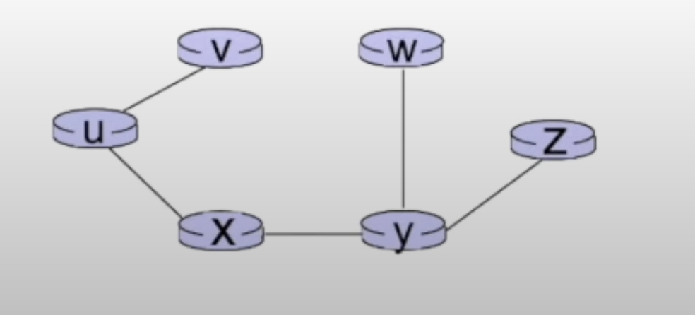

# The Network Layer: the Control Plane
## Routing Algorithms
### Dijkstra's Algorithm
#### Notations
- **C(a,b):** direct link cost from node a to node b;
  - cost = ∞ if there is no direct link.
- **D(a):** current estimate of `least-cost-path` from source to destination a
- **P(a):** predecessor node along the path from source to a.
- **N´:** set of nodes whose `least-cost-path` definitively known.

#### Example
  

| Step | N'     | D(V),P(V) | D(W),P(W) | D(X),P(X) | D(Y), P(Y) | D(Z), P(Y) |
|------|--------|-----------|-----------|----------|------------|------------|
| 0    | u      | 2,u       | 5,u       | 1,u      | ∞          | ∞          |
| 1    | ux     | 2,u       | 4,x       |      | 2,x        | ∞          |
| 2    | uxy    | 2,u       | 3,y       |      |        | 4,y        |
| 3    | uxyv   |       | 3,y       |      |        | 4,y        |
| 4    | uxyvw  |       |       |      |        | 4,y        |
| 5    | uxyvwz |       |       |      |        |        |

- **Step 0:** The first step is the initialization.
  - Also, to find the distance from initial node(u) to other adjacent nodes.
  - It is also the time to pass through the loop
    - Find a such that is not already in N', such that D(a) at a minimum.
    - After that we add that to N'.
- **Step 1:** Update D(b) for all b adjacent to a and not in N':
  - Let's update all the nodes. `Forumula:` D(b) = min(D(b), D(a) + C(a,b))
    - D(v) = min(D(v), D(x) + C(x,v)) = min(2, 1+2) = 2
    - D(w) = min(D(w), D(x) + C(x,w)) = min(5, 1+3) = 4 `New`
    - D(y) = min(D(y), D(x) + C(x,y)) = min(∞, 1+1) = 2 `New`
  - Now if we look at the table, there are two minimums(v and y) with length 2. 
  Let's go with y.
- **Step 2:** Now we do the same process again.
  - `Updating Formula:` D(b) = min(D(b), D(a) + C(a,b))
    - D(w) = min(D(w), D(y) + C(x,w))= min(4, 2+1) = 3
    - D(y) = min(D(z), D(z) + C(y,x)) = min(∞, 2+2) = 4
  - Now the minimum distance is 2 for v. So let's add v to the N'.
- **Step 3:** We repeat the same process.
  - `Updating Formula:` D(b) = min(D(b), D(a) + C(a,b))
    - D(w) = min(D(w), D(u) + C(v,w)) = min(3, 2+3) = 3
  - Now the minimum distance is 3. So let's add w to the N'.
- **Step 4:** Repeating the same process.
  - `Updating Formula:` D(b) = min(D(b), D(a) + C(a,b))
    - D(z) = min(D(z), D(y) + C(w,z)) = min(4, 3+5) = 4
    - Since, 4 already exists, there will be no update.
- **Step 5:** Since Z is the only one left, we also add Z to the N'.

  
  
  

- **algorithm complexity:**
- n nodes
- for each n iteration: need to check all nodes, w not in n
- **n(n+1)/2** comparisons: O(n^2) complexity.
- More efficient implementation possible.

- **message complexity:**
- each router must broadcast its link state information to other n
routers.
- efficient (and interesting!) broadcast algorithms: O(n) link crossing
to disseminate a broadcast message from one source to another.
- each router's message crosses O(n) links: overall message complexity:
O(n^2).

### Bellman Ford Algorithm
- If I am an algorithm, I am going to wait. I will wait until I get a
distance vector from directly attached to my distance neighbor. Or I will
wait for local link cost change.
- After I receive one of these events, I am going to run the bellman ford
calculation for all destinations in the network, recently received from the
distance vector from my neighbors.
- If my distance vector changes, I am going to send my new distance vector
to all my neighbors.
- We do that continuously.

#### Example
  
  
  

### Intra-Domain Routing vs. Inter-Domain Routing
- **Intra-Domain Routing (IDR):**
Intra-Domain Routing refers to the process of routing traffic within a 
single autonomous system (AS). An autonomous system is a network or 
group of networks under a single administration. IDR is responsible for 
routing traffic within a single AS, ensuring that packets are delivered 
efficiently and correctly within the network.

- **Inter-Domain Routing (IDR):**
Inter-Domain Routing, on the other hand, refers to the process of routing 
traffic between multiple autonomous systems. IDR is responsible for routing 
traffic between different ASes, ensuring that packets are delivered 
efficiently and correctly between networks.

**Key differences:**
1. **Scope**: IDR operates within a single AS, while IDR operates between 
multiple ASes.
2. **Routing decisions**: IDR makes routing decisions based on intra-domain 
metrics, such as link costs and hop counts. IDR makes routing decisions 
based on inter-domain metrics, such as paths and autonomous system numbers.
3. **Routing tables**: IDR maintains a routing table within the AS, while 
IDR maintains a routing table between ASes.

### OSPF and RIP
#### OSPF (Open shortest path first)
- Is a link state routing protocol that uses Dijkstra's Algorithm.
- By using Dijkstra's algorithm, it tries to calculate the shortest path.
- It's known for fast convergence suitable for large networks.
- OSPF supports both IPV4 and IPV6.
- It uses multicast addressing for routing updates.

#### RIP (Routing Information Protocol)
- It Is a distance-vector routing protocol that uses Bellman Ford algorithm.
- It is simpler than OSPF, but limited by maximum hop count 15.
- It is used mostly in smaller networks.
- RIP uses UDP for transporting routing updates.

### Areas in OSPF
In OSPF, an area is a logical grouping of routers that are connected by a 
common network. Areas are used to partition the OSPF routing domain into 
smaller, more manageable pieces. Each area is identified by a unique area ID.

- **Area Types**
  - **Stub Area:** A stub area is an area that has no external connections. 
  It only communicates with its neighboring areas through an ABR (Area Border 
  Router).
  - **Transit Area:** A transit area is an area that has external connections 
  and allows traffic to pass through it.
  - **Stubby Area:** A stubby area is a special type of stub area that does 
  not allow AS-external routes to be advertised into the area.

### Two level Hierarchical OSPF
- In OSPF (Open Shortest Path First), a two-level hierarchy is used to optimize 
and scale network routing. This hierarchy consists of:
- **Level 1 routers (Intra-Area):** These routers have knowledge of their own 
area’s topology and route traffic within the area using OSPF.
- **Level 2 routers (Backbone or Inter-Area):** These routers form the backbone 
of the OSPF network, known as Area 0. They are responsible for routing 
traffic between different areas.
- The two-level hierarchy simplifies the routing process and prevents routing 
loops by ensuring that all traffic between non-backbone areas must pass 
through the backbone area. This design also helps in reducing the size of 
the routing table and limiting the scope of route calculations to within 
individual areas, thus improving overall network performance

### eBGP vs iBGP
#### iBGP (internal BGP)
- iBGP is used within an autonomous system (AS) to exchange routing information
  between routers within the same AS.
- iBGP is typically used within a single organization or AS to ensure that
  all routers have the same routing information and can route traffic correctly.

#### eBGP (external BGP)
- eBGP is used to exchange routing information between autonomous systems 
(AS) on the internet.
- eBGP is typically used to connect different ISPs, content providers, or 
other organizations that need to exchange routing information.

### How Potato Routing works in BGP
- Hot Potato Routing is a technique used in Border Gateway Protocol (BGP) to 
optimize the routing of IP packets. It's also known as "Hot Potato" or "Push 
and Pull" routing.

- In traditional BGP, when a router receives a BGP update message, it checks if 
the update is more specific than the current best path. If it is, the router 
updates its routing table. However, this can lead to suboptimal routing, 
especially in networks with multiple paths to the same destination.

- Hot Potato Routing addresses this issue by introducing a new concept called 
"push and pull". When a router receives a BGP update, it checks if the update 
is more specific than the current best path. If it is, the router "pushes" the 
update to its neighbors, which then "pull" the update to update their own 
routing tables. This process continues until the update reaches the destination 
router.

### Distance Vector Algorithm
- Each router has its own routing table.
- In its table it stores every router and cost, via for each particular router.
- Each router sends its own table to its neighbors.
- Each node then updates its own table.

#### Count to infinity Problem

  

From the picture we can see, each router has its own table.
- In each entry, it mentions the cost to go to one of the nodes.
- It also mentions which routers it takes and the first node
in that route, notating using 'via'

Now let's say for some reason, router B lost its connection to
C. So table for both Router B and C gets updated, as router B and C
both know they lost their connection with each other. 
- Router B then looks at the Table A and finds out there is a way
to get to C which is via A. It then updates its values.
- Router A, then gets the updated value from router B. It also then
updates its values.

As you can see, this updating value continues to persist. The corresponding
values tend to go to the infinity. This phenomenon is called `Counting to 
Infinity` problem.

#### Solution 1: Split Horizon
This technique prevents a router from advertising a route back out of the 
interface from which it was learned. Essentially, it means that if a router 
learns about a route from a particular neighbor, it will not advertise that 
same route back to that neighbor. This helps to prevent loops where information 
might otherwise bounce back and forth between routers, eventually stopping
count to an infinity problem.

#### Solution 2: Route Poisoning
When a route becomes invalid, route poisoning involves advertising that route 
with an infinite metric, effectively telling all other routers that the route 
is unreachable. This is done immediately to all nodes in the network, ensuring 
that the bad route is quickly invalidated and not used by mistake, which helps 
to prevent the count-to-infinity problem.

### Count to Infinity Problem: OSPF (Open shortest path first)
In OSPF, the count to infinity problem does not exist in OSPF. Since:
- OSPF builds a complete and accurate map of the network topology by 
exchanging `LSA(Link Change Advertisements)` with other routers.
- This map is then used to compute the shortest tree to each route.
- Since, OSPF routers have complete knowledge of the network's topology,
they can detect and avoid routing loops.
- Hence, they do not rely on incremental path cost updates like distance
vector protocols do.

### Count to Infinity Problem: Border Gateway Protocol (BGP)
BGP (Border Gateway Protocol) solves the count-to-infinity problem using its 
unique path vector protocol mechanism. Unlike distance vector protocols, BGP 
does not rely on hop count as a metric but instead uses path information to 
make routing decisions. Here's how BGP addresses the issue:

- **Path Vector Protocol**: BGP advertises the complete path that a route has
taken through different autonomous systems (AS). If a BGP router receives a 
route that includes its own AS number in the path, it will reject the route 
to prevent loops.

