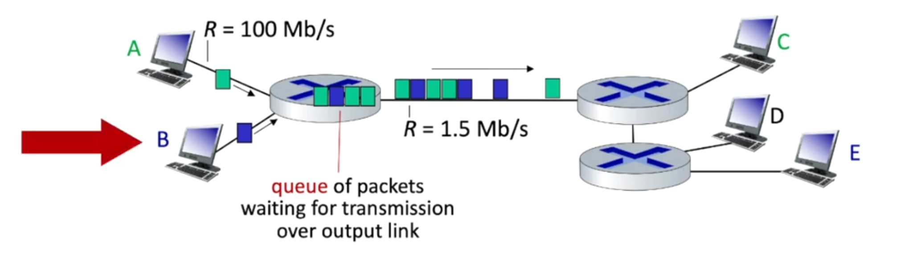
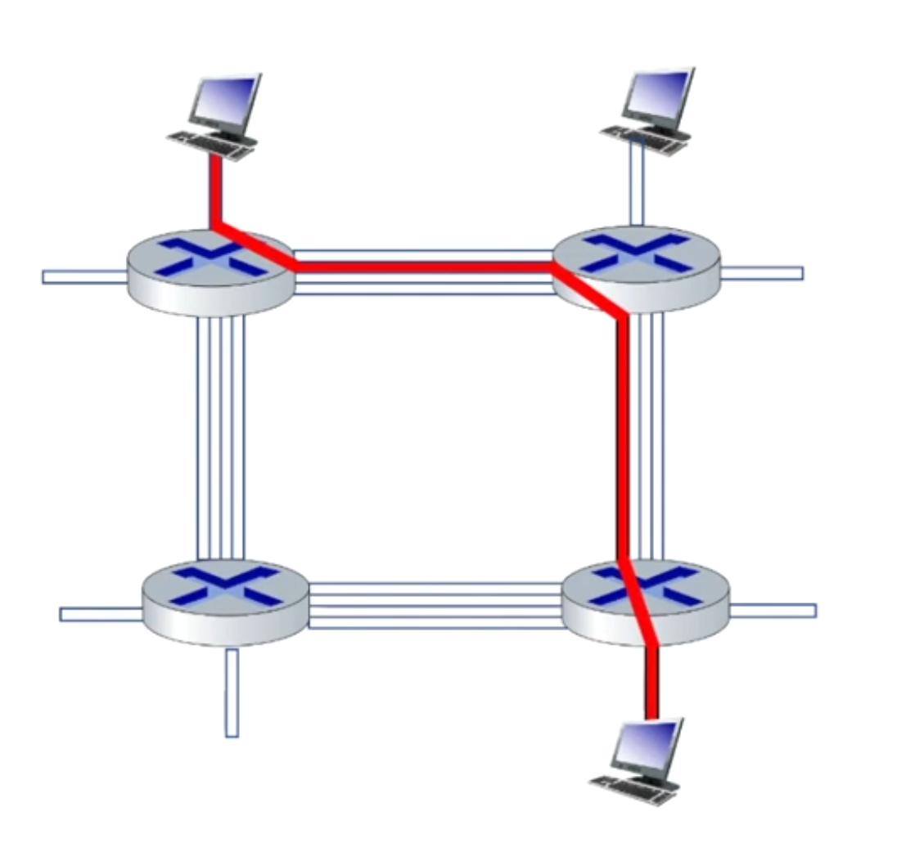
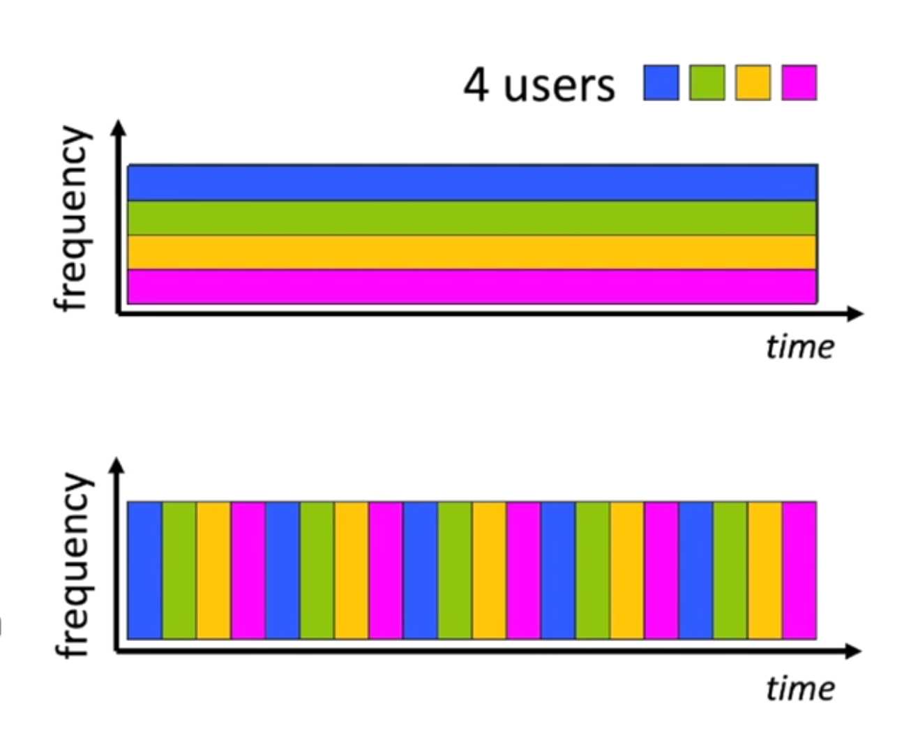
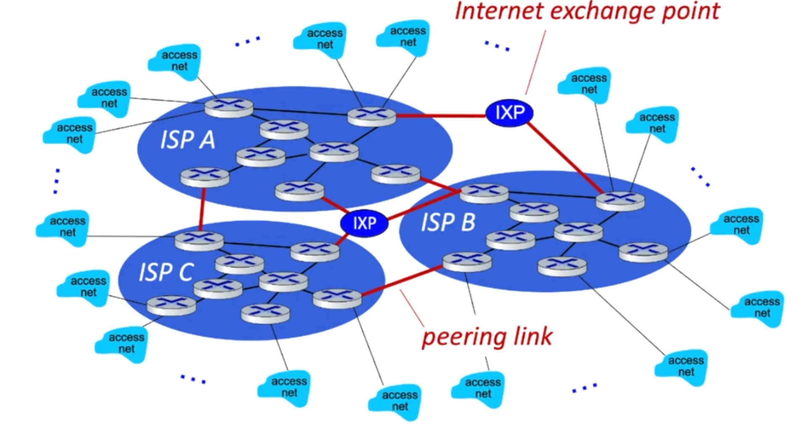
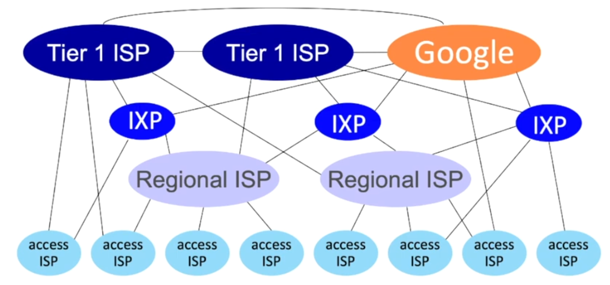
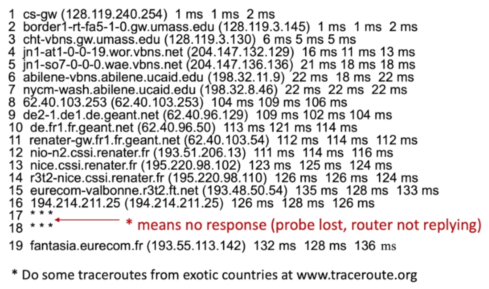
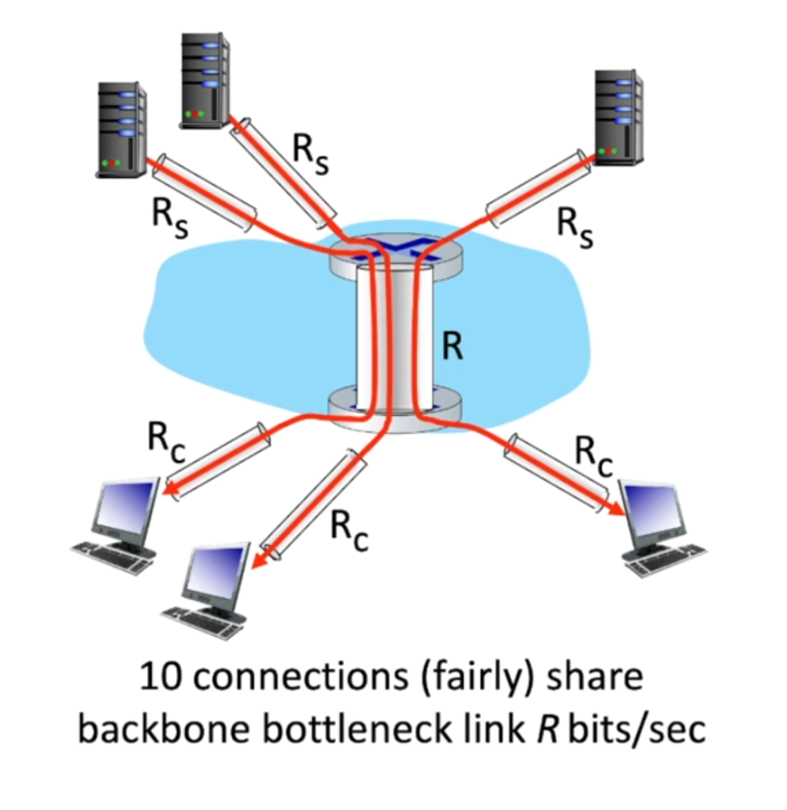
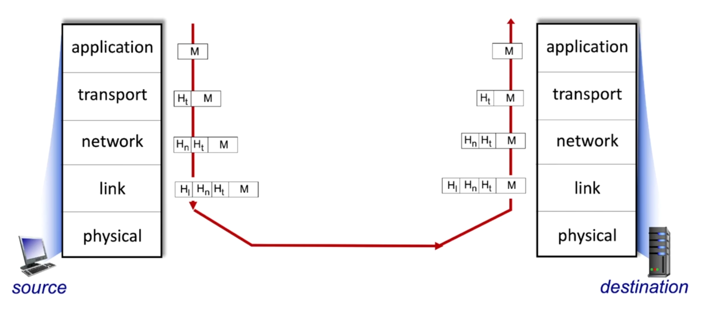

# Lecture-1
##### Internet
- The Internet is an interconnected network of networks.
> Exam Question: What is Internet?

##### Protocol
- Sending and Receiving information between Router, Switches and Many other end
devices is controlled by protocol. Protocol governs everything that happens in a 
network.
- Protocols define the format, order of messages sent and received among network
entities, and actions taken on message transmission, receipt.
> Exam Question: What is Protocol?

> IETF: **Internet Engineering Task Force** governs the Internet standards using
**Request for Comments**

###### Access network
Access network is the host, (the device or the end system) that connects to
the internet.  
**How to connect host systems to edge router?**  
*Answer:* Here are some ways:
- Residential access nets
- institutional access nets(school, company)
- mobile access network(Wifi/4G)
**What to look for**
- transmission rate (bits per second) of access network. AKA how fast is the network.
- shared or dedicated access among the users (AKA to what degree the network is shared)

##### Access Networks: cable-based access
In access network, a single cable headed connects multiple homes. The signal from and
to those houses are sent at different frequencies. Different frequencies do not interpret
with each other just like FM radio frequencies.

- *Frequency division multiplexing(FDM):* Different channels multiplied in a different frequency
band.
- *HFC: Hybrid fiber coax:* They are asymmetric, which means they provide data in a downstream
manner rather than upstream. Which means we are consumer of data rather than producer of
data. Typical cable transmission rates are 40MBPS - 1.2GBs downstream transmission rate,
30-100Mbps upstream transmission rate. Usually your modem will limit the upstream and the
downstream limit. Basically, you get what you pay for.

##### Access networks: digital subscriber line(DSL)
- Use existing telephone line to central office DSLAM
    - data over DSL phone line goes to the Internet
    - voice over DSL phone line goes to telephone net
- 24-52 Mbps dedicated downstream transmission rate
- 3.5-16 Mbps dedicated upstream transmission rate

#### Access networks
##### Home networks
Traditional home network which has a device. It is connected with router and modems.

##### Wireless access networks
1. Wireless local area network (WLANs)
- Typically, within or around building (100ft)
- Typically, standardized by IEEE under the protocols of 802.11 b/g/n.

##### Wide-area cellular access networks
- provided my mobile, cellular network operator (10's km)
- 10's Mbps
- 4G cellular networks (5G coming)

Other access networks are:
1. Enterprise networks
2. Data center networks

#### Host: Sends packets of data
host sending function:
- take an application message
- breaks into smaller chunks, known as packets, of length L bits
- transmits packet into access network at `transmission rate R`
    - link transmission rate, aka link `capacity, aka link bandwidth`
> packet transmission delay = time needed to transmit an L-bit packet into 
a link = L(bits)/R(bits/sec)

#### Links: Physical Media
- `bit:` We transfer bits from transmitter to receiver using a physical media.
- `physical link:` what lies between transmitter & receiver.
1. `Guided media`: Signals propagate in solid media: copper, fiber, coax. There are
couple of guided medias. Some examples of guided media are the following:
- `Coaxial cable:`
  - two concentric copper conductors
    - bidirectional
    - broadband, old fashioned internet used to run on this method.
        - multiple frequency channels on cable
        - 100's Mbps per channel
- `Twisted pair(TP)`: two insulated copper wires
    - Category 5: 100 Mbps, 1Gbps Ethernet
    - Category 6: 10 Gbps Ethernet
- `Fiber optic cable:`
  - glass fiber carrying light pulses, each pulse a bit
    - high-speed operation:
        - high-speed point-to-point transmission (10's - 100's Gbps)
    - low error rate:
        - repeaters spaced far apart
        - immune to electromagnetic noise
2. `Unguided Media:` signals propagate freely e.g., radio  
`Wireless Radio`:
- signal carried in various "bands" in electro-magnetic spectrum.
- no physical "wire"
- broadcast, "half-duplex" (sender to receiver)
- propagation environment effects:
    - reflection
    - obstruction by objects
    - Interference/noise
`Radio link types:`
  - `Wireless LAN(WiFi):` 10-100's Mbps; 10's of meters.
  - `Wide-area (e.g., 4G cellular):` 10's Mbps over ˜10 Km
  - `Bluetooth:` cable replacement
    - short distances, limited rates
  - `Terrestrial microwave:` point-to-point; 45 Mbps channels
  - `Satelite`:
    - upto 45 Mbps per channel
    - 270 msec end-end delay

#### The network core
- The network core consists of interconnected routers which are interconnected
by communication links.
- The internet's core operation consists of a concept called `packet switching`
    - **Packet Switching:** The end host takes application of messages, devides
    those messages into chunks of data, puts those data inside a package and sends
    those packages into the internet.
    - After that, network forwards packets from one router to the next, across
    links on path from source to destination.

There are two network-core functions
1. **Forwarding:** It is essentially taking a packet of data and sending it to the
appropriate customer. In more details, when data arrrives it comes with a value.
The router then looks into the forwarding table. When data matches with one table
it forwards the data into the proper router.  

Now you might be wondering how the content of the forwarding table is created. That's
where routing comes into the equation.

2. **Routing:** Routing is the `global action` that determines source-destination paths
taken by packets. Routing algorithms compute the local per-router forwarding tables needed
to realize to find the end to end paths.

> Exam Question: What are routing and forwarding.

#### Packet-switching
##### Store and forward
- **packet transmission delay:** takes L/R seconds to transmit (push-out) L-bit packet into
a link at R bps
> One-hop numerical example: L = 10 Kbits, R = 100 Mbps, one-hop transmission delay = 0.1 msec

- **store and forward:** In store and forward method, the entire packet must arrive at router
before it can be transmitted on next link.

##### Queuing

Let's say host A is sending package to host C and host B is sending package to host E. Now in the
first router, there is a queue of packets waiting for transmission over output link. Which leads
us to:
- `Packet queuing and loss:` if arrival rate (in bps) to link exceeds transmission rate (bps) of
link for some period of time we find:
    - packets will queue, waiting to be transmitted on output link
    - packets can be dropped(aka lost) if memory(buffer queue) in router fills up

Packet switching is not the only way to build a network. Long before internet existed for telephone
network, we used circuit switching.
##### Circuit switching
- end-end resources allocated to, reserved for "call" between source and destination  

- in diagram, each link has four circuits.
  - call gets 2nd cirucit in top link and 1st circuit in the right link
- dedicated resources: no sharing
  - circuit-like (guranteed) performance
- circuit segment idle if not used by call (no sharing)
- commonly used in traditional telephone networks

There are two types of circuit switching: FDM and TDM
1. `Frequency Division Multiplexing (FDM):` 
- optical, electromagnetic frequencies divided into (narrow)
frequency bands.
- each call allocated its own band, can transmit at max rate of that
narrow band

2. `Time Division Multiplexing(TDM):`
- time divided into slots
- each call allocated periodic slot(s), can transmit at maximum rate of
  (wider) frequency band during its time slot(s)

##### Packet switching vs Circuit Switching
Example:
- 1 Gb/s link
- each user:
  - 100 Mb/s when "active"
  - active 10% of time

Q. How many users can use this network under circuit-switching and packet switching?
- **circuit switching** 10.
- **packet switching**: with 35 users, probability > 10 active
at same time is less than .0004*

##### Internet structure: a "network of networks"
- Question: given millions of access ISPs, how to connect them together?
- Answer: Having some transit ISP  

#### Performance
- How do packet delay and loss occur?
- Packet queue in router buffers, waiting to turn for transmission. It is also known
as **transmission delay.**
  - queue length grows when the arrival rate to link (temporarily) exceeds output
  link capacity. AKA **queueing delay**.
- packet loss occurs when memory to hold queued packets fills up

##### Packet delays
1. **d(PROC): Processing delay:**
- It is associated with forwarding table look up.
- Putting packets into the correct switch
- Also doing some integrity checks.
- This delays are in the orders of microseconds or less.
2. **d(QUEUE): Queueing delay:**
- Queuing delay occurs waiting for packets in the router queue waiting for transmission.
In other words, time spent at output link for transmission.
- depends on congestion level.
3. **d(Tran):Transmission delay:**
- L: packet length (bits)
- R: link transmission rate (bps)
- d(Trans) = L/R
4. **d(Prop): Propagation delay:** This is the delay when a bit enters the sending side of
the link and pops out from the receiving side of the link.
- d: length of a physical link
- s: propagation speed(˜2x10ˆ8 m/sec)
- d(prop) = d/s

###### Packet queueing delay (revisited)
- a: average packet arrival rate
- L: packet length(bits)
- R: link bandwidth (bit transmission rate)

La/R = (arrival rate of bits/service rate of bits) ("traffic intensity")

- La/R~0: avg. queuing delay small
- La/R->1: avg. queueing delay large
- La/R>1: more "work" arriving is more than can be serviced - average
delay infinite!

###### Real Internet delays and routes
traceroute: gaia.cs.umass.edu to www.eurecom.fr  

###### Packet loss
We have to remember that packet loss can occur even when the router buffer
fills up and the arriving package has no place to be stored.
- In congestion scenarios, the losses can be high.

###### Throughput
Throughput in a network refers to the rate at which data is successfully
transmitted within the network. It is a measure of amount of data that
can be transferred over the network in a given amount of time.

From the picture we can see that the throughput in this connection is
min(Rc, Rs, R / 10)

> Exam Question: What are delay, loss and throughput

##### Layering
Approach to designing/discussing complex systems:
- Layering helps us in identifying in different pieces of the systems and
relationship to each other. In other words, we have a clear reference
how the systems interact with each other.
- We have really modularized the design by layering. When we think in a
concrete term, the layer takes information from above (internet), and uses
the services one layer below to implement it's own service.

###### Layered Internet Protocol stack
There are 5 layers in the Internet.
1. **Application:** Application layer consists of protocols which are responsible
for sending and receiving of applications. e.g. HTTP, IMAP, SMTP, DNS
2. **Transport:** Transport layer transports application layer messages from one layer
to another. We saw earlier packets could be lost due to buffer in routers.
- TCP, UDP
- Transport layer provides a reliable data transfer guarantee on top of a layer
which has the possibility of losing the data. That's what internet's TCP protocol
does.
3. **Network:** Network layer routes the data from one network device to another sometimes
reliably and sometimes not. In other words, the network layer does not provide reliable
transfer from one host to another.
- IP, routing protocols.
4. **Link:** Link layer transports data between two network devices that are either ends
of the same communication link. 
- Ethernet, 802.11(Wifi), PPP
5. **Physical:** bits `on the wire`

###### Servicing, Layering and Encapsulation
1. **Application:** On application layer, the data it exchanges are called message.
2. **Transport:** What transport layer does is that, it takes a message from application
layer and adds some additional part. In more concrete terms, Transport layer protocol
encapsulates an application-layer message, M, with transport layer header H(t) to create a
transport-layer segment. It also notated as H(t)M
> Taking data from one network layer and adding more information to the current message 
is called encapsulation.
3. **Network:** Network layer protocol `encapsulates` transport layer segment H(t)M with
network layer header H(n) to create a network layer `datagram`.
- H(n) used by network layer protocol to implements in service. So the final term is H(n)H(t)M
4. **Link:** Just like the layers above, link layer adds also adds it's own header and makes
it, `H(i)H(n)H(t)M`.

> As data flows down the stack, headers are progressively added to the segment, and then
to the datagram and then to the frame and going across the wire. As data goes up the stack,
those data are progressively read, acted upon and removed.

> Exam Question: How does packet travels with every layer. 

### Network Security
- Internet was not originally designed with (much) security in mind.
  - `original vision`: A group of mutually trusting users attached to a transparent network.
  - Hence, we are still catching up for the network security.

- We now need to think about:
  - how bad guys can attack computer networks
  - how we can defend networks against attacks
  - last but not the least, how we can design the architecture so that they
  are immune to attacks.
  
#### Bad Guys: Packet "sniffing"
Bad actors can stay between sender and receiver to sniff packets. Such packet sniffing can be
done using `Wireshark (a packet sniffing tool)`

#### Bad Guys: fake identity
- `IP Spoofing:` Say, B is sending the data to A. C can stay in between and send the data
to A and pretent like B is sending the data. This phenomena is called `IP Spoofing

#### Bad guys: denial of service
- `Denial of service(DoS)`: DoS attack happens when a bad actor bombards the server with fake
requests that servers memory runs out. Hence, it cannot process new request as the memory is
full.

##### Lines of defense
The above mentioned operations could be couple of ways to do bad activites on the internet. In
order to develop a shield against the attack, we can take couple of ways:
1. **authentication:** Proving you are who you say you are
2. **confidentiality:** We can protect data being sniffed via encryption.
3. **Integrity checks:** We can also check if the data was being tempered with using 
digital signatures prevent/detect tampering.
4. **Access restrictions:** Password-protected VPNs
5. **Firewall:** Thre are specialized pieces of hardware known as firewall which sets in
between to detect and mitigate attacks.
- Firewall sets in between in order to let specific packets from restricted senders and
receivers to do applications.
- detecting/reacting to DOS attacks

> Exam Question: Explain different lines of defenses. e.g., Authentication, Confidentiality,
> Integrity checks, Access restrictions and Firewall.

