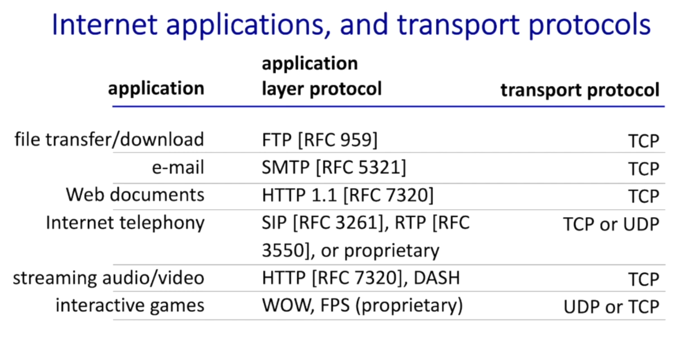
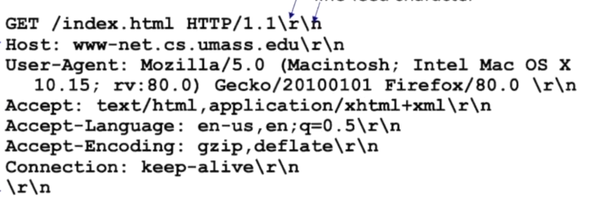
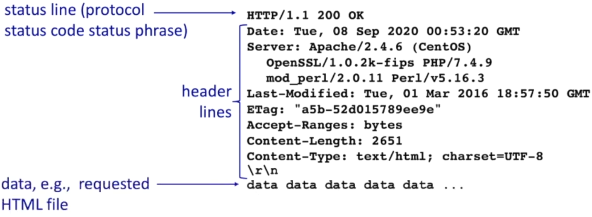
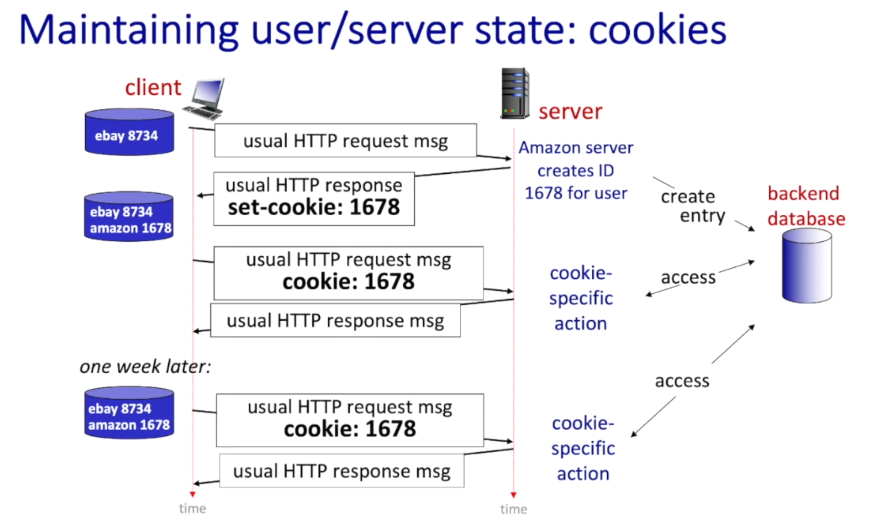
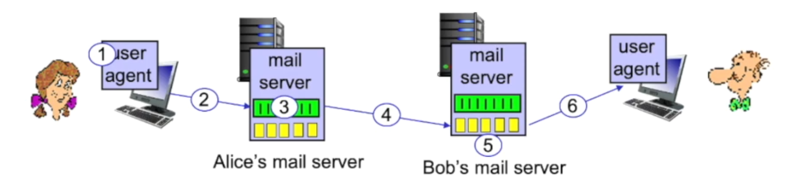

# Application Layer
## Client-server paradigm
- Host
1. Always-on host
2. Most of the time they have permanent IP address
3. Often can be found in colleges, data centers for scaling.

- Clients
1. Clients communicate by contacting and communicating with server.
2. The Client will be intermittently connected with the server.
3. Hence, they will not have a permanent IP address. They will be rather having dynamic addresses.
4. Most important, clients do not communicate with each other. Rather, they will
communicate with server.
5. Examples: HTTP, IMPA, FTP

### Peer-peer architecture
1. In peer to peer, there is no always on server.
2. Instead, they request service from other peers. In return, they provide service from other peers
also.
   - `Self Scalability:` New peers bring new service capacity, as well as new service demands.
   - We can see the same thing in File sharing, where peer receives files from one peers and
   shares it with other peers.
3. Peers are going to be intermittently with the internet. Hence, they are going to change
the IP address.
    - Hence, the coming and going architecture is much more complex than server systems.
4. Example: P2P file sharing.

### Process communicating
As we have seen, network entities will consist of a set of interactive pieces whether that is in
client server module or peer-to-peer model. So, there will not be a single standalone program rather
there will be multiple programs. When these programs are running, they are instantiated with a
process.
- If the processes are running within the same host(computer), it is called inter-process
communication (defined by OS).
- When processes run on different hosts, they communicate using messages.

### Sockets
The application programming interfaces (API), bound to the transport layer, use an abstraction
called socket. 
- Processes going to send and receive messages using `Socket.`
- Socket analogous to a door
  - We send messages to the door and receive messages out of the door.
  - The sending and receiving of messages is going to rely on underlying infrastructure (transport
  layer, network layer or link layer), from a socket in the sending end to the receiving end.
  - It is also important to know, there will be two sockets involved. One in the sending side and
  one on the receiving side.

> Exam Question: What is a socket?

### Addressing process
When you want to communicate with someone, you need some addressing information. If you are sending
them a letter, you need the address in which City or town they live in. If you are calling someone,
you need a phone number or country code.
- It is the same thing when trying to communicate using a socket. We need some methodology to communicate
with the other end point of the socket.

When we create a socket, there will be two important pieces of information associated with it.
1. The IP address
2. The port number
   - Example port number:
     - To connect with the HTTP server: Port number 80
     - To connect with the mail server: Port number 25

#### An application-layer protocol defines:
Protocol defines the format, the order message received among network entities, actions taken a message received
and transmission. So to define an application layer protocol, we need to define
1. `Types of messages` that has been exchanged.
2. `Message syntax`: What are the fields of the messages.
3. `Message semantics:` What are the meaning the of fields.
4. `Rules:` On what actions have been taken before and after
sending a message.

There are two types of protocols:
1. `Open protocols:` They are open in a sense that, their message syntax, message semantics and actions
are publicly available. All internet protocols are publicly available, RFC (Request for comments)
2. `Proprietary protocols:` Their applications are not publicly known, e.g.: Skype, Zoom

#### What transport layer services does an app need?
##### Data Integrity
- Some services need reliable (100%) data transfer e.g., File Transfer, Web Transactions
- Other services may tolerate some packet loss, e.g., Audio

##### Timing
- Some applications need a timing guarantee to be effective, e.g., Internet Games

##### Throughput
- Other applications need a certain amount of throughout to be effective. e.g., multimedia or streaming videos,
as it requires a certain amount of throughput.

##### Security
- The Transport layer may provide some security services like encryption on given data.

### Internet transport protocols services
|                         | TCP Service                                                                                  | UDP Service                                                                     |
|-------------------------|----------------------------------------------------------------------------------------------|---------------------------------------------------------------------------------|
| **Reliable Transport**  | TCP provides reliable transport between  sending and receiving process                   | UDP has a unreliable data transfer between  sending and receiving processes |
| **Flow Control**        | TCP guarantees that sender will not overwhelm  receiver                                  | Does not provide flow control                                                   |
| **Congestion Control**  | TCP sender is also congestion controlled when  network is overloaded                     | Does not provide congestion control                                             |
| **Connection Oriented** | TCP also connection oriented means handshakes is   before data from sender to receiver| Does not provide connection control                                             |
| **Does not provide**    | TCP does not provide timiing, minimum throughput   gurantee, security                     | --------------                                                                  |

**Question:** You might be wondering, for which cases do we need UDP?  
**Answer:** We can start with UDP and start adding other services for example, Flow control and Congestion control
on top of UDP.  

> Exam Question: TCP vs UDP

## Web and HTTP—Part-1
First, a quick review...
- Web page consists of **objects**, each of which can be stored on different Web servers.
- Object can be HTML file, JPEG image, Java applet, audio file,.....
- Web page consists of **base HTML-file** which includes **several referenced objects,
each** addressable by a **URL,** e.g. www.someschool.edu/comeDept/pic.gif
  - www.someschool.edu -> host name
  - someDept/pic.gif -> path name

### HTTP overview
HTTP - `Hypertext transfer protocol`
- Web's application layer protocol. HTTP follows the client and server model:
  - `Client:` The typical example of a client is the browser. In addition,
  there could be some other devices that can act as a client, for example,
  mobile apps.
  - `Server:` Web server sends (using HTTP protocol) objects in response to
  requests.

#### HTTP uses TCP
- HTTP clients open a TCP connection using a web server on port 80 whether 
through browser or other device.
- One or more HTTP messages are exchanged between a client and server.
- Then TCP connection is closed.

#### HTTP is "stateless"
- the server maintains no information about past client requests.
> Now you might ask why is that. Because, the protocols that hold 
previous states have to go through a rigorous process of cleaning
previous statues, if one state in between fails.

#### HTTP connections: Two types
| Non-persistent HTTP                                            | Persistent HTTP                                                                                                      |
|----------------------------------------------------------------|----------------------------------------------------------------------------------------------------------------------|
| 1. A TCP connection is opened                                  | 1. A TCP connection opened to a server.                                                                              |
| 2. At most one object sent over TCP connection                 | 2. This time, multiple objects can be transferred with a single TCP connection between the client and server |
| 3. TCP connection closed                                       | 3. When multiple objects have been transferred, now TCP connection has been closed.                              |
| Downloading multiple objects required multiple connections | Persistent HTTP refers to HTTP1.1 which is the most common HTTP version used today.                              | |

#### Non-persistent HTTP: example
1. HTTP `client` initiates TCP connection to HTTP server (process) at 
www.someSchool.edu on port 80
2. HTTP `server at host www.someSchool.edu waiting for TCP connection at
port 80 "accepts" connection, notifying the client.
> Notice: In step 1 and 2, no HTTP connection has been flowed yet. That
happens in STEP: 3
3. HTTP `client` sends an HTTP request message (containing URL) into TCP connection.
This http message indicates that the client wants to receive the base html file. 
someDepartment/home.index
4. Now HTTP `server` receives a request message, forms `response message` containing
a requested object, and sends a message into its socket.
5. After sending the response message, the HTTP `server` closes the TCP connection.
6. HTTP client receives a response message containing html file, displays.html. Finds,
10 references jpeg objects.
7. Now, all the steps from 1 to six have to be repeated for each of 10jpeg objects.

#### Non-persistent HTTP: response time
- `RTT(Round trip time):` Very small-time needed for a packet to travel from client to server
and back.
- `HTTP response time (per object):` 
  - one RTT to initiate TCP connection. (Step 1 and 2)
  - one RTT for HTTP request and the first few bytes of HTTP response to return. (Step 3 and 4)
  - object/file transmission time.
`Non-persistent HTTP response time = 2RTT + file transmission time.`

#### Persistent HTTP
As we have seen with the Non-persistent HTTP, we need 2RTT for a single object to be transferred.
But we can do it better. That's where persistent HTTP comes into play. In persistent Http we need
around 1RTT. It is also used in the modern web servers.
- server leaves connection open after sending response
- subsequent HTTP messages between the same client/server sent over open connection without waiting 
for RTT to establish a new connection.
- Client sends requests as soon as it encounters a referenced object.
- From this we can see we have just reduced the timing to 1RTT

### HTTP messages
- two types of HTTP messages: request, response
- **HTTP request message:** 
  - ASCII (human-readable format)

  

A sample HTTP request has been given:
1. `Request line (GET, POST, HEAD Commands):` GET /index.html HTTP/1.1\r\n
2. `Header lines:`
   - **Host:** in this case www-net.cs.umass.edu\r\n
   - **User-Agent:** Mozilla
   - **Accept:** It is accepting application xml
   - **Accept-Language:** The language it accepts
   - **Accept-Encoding:** gzip, deflate\r\n
   - **Connection:** keep-alive\r\n, which states to keep the connection alive even
   after establishing.
3. `Entity body:` In this example we didn't need something in the entity body.
But for POST request, we may need this part.

#### Other HTTP request messages
##### GET Method
- includes user data in the URL field of HTTP GET request message (following a '?'):
  - www.somesite.com/animalsearch?monkeys&banana

##### POST Method
- Web page includes form input
- user input sent from client to server in `entity body` of an HTTP POST request message.

##### PUT Method
- uploads new file (object) to server
- completely replaces file that exists at specified URL with content in `entity body`
of POST HTTP request message.

##### HEAD method
- asks for requests identical to head method, which is identical to GET method without
the response body.
- It could be used to get the size of the object without retrieving the size of the
object.

#### HTTP response message
  

#### HTTP response status codes
- status code appears in the 1st line in a server-to-client message.
- some sample codes:
    - **200 OK**
      - request succeeded, requested object later in this message
    - **301 Moved Permanently**
      - requested object moved, new location specified later in this message (in Location: field)
    - **400 Bad Request**
      - request message not understood by server
    - **404 Not Found**
      - requested document not found on this server
    - **505 HTTP Version not Supported**

### Maintaining user/server state: cookies
As mentioned above, HTTP is a stateless protocol, means it does not hold previous states.
When information from the previous states is necessary, Web sites and client browser use
**cookies** to maintain some state between transactions.

- Four components to cookies:
  1. At some point, the server is going to send the client a cookie. The cookie will hold
  a number.
  2. The next time, the client is going to send the number to Server in the cooking
  header line.
  3. The server will remember the requests and responses associated with the cookie value.
  So it will have a history of interaction with the user.

#### An example:
  

1. In the first step ebay `client` gives a request to amazon server.
   - Amazon `server` accepts the request, creates a cookie ID-1678, enters the information into
   the backend database and gives an HTTP response with cookie ID-1678.
   - For example, First time the client may be looking for some workout accessories. The server
   stores the history of workout accessories with the cookie ID-1678.
2. The next time, `client` gives a request to the amazon server, it does some cookie-specific actions.
   - It returns a traditional HTTP response.
   - For example, this time the `server` remembers the previous history using the cookie ID. Hence,
   it recommends users to buy specific workout accessories.
3. One week later, when the user gives another HTTP request with 1678 cookie-ID, the amazon server 
  does another cookie-specific action. 
   - It may remind user that, you forgot to buy workout accessories.

#### What cookies can be used for:
1. `Authorization:` It can be used for authorization. The sever can remember through cookies that
you authorized.
2. `Shopping carts:` The server can keep a memory of what was in your shopping cart using cookie.
3. `Recommendations:` On the basis of your previous history tracked through cookies, the server
can give some recommendations.
4. `User session state:` It can store of your browsing state.

## Email
Three major components to Email:
1. `User agents`: 
   - The agent that user uses to write email, aka `mail reader`
   - Composing, editing, and reading mail messages.
   - e.g., Outlook, iPhone mail client.
   - outgoing, incoming messages stored on server.
2. `Mail servers`: The server where a user stores an email. An email server has two
sets of messages:
    - `mailbox`: contains incoming messages for user.
    - `message queue`: It has a queue of messages to the destination SMTP server.
3. `Simple mail transfer protocol: SMTP`: The protocol that governs the sending and
receiving of the email between servers. It operates on `client-server` paradigm.

#### Scenario: Alice sends e-mail to Bob
1. Alice uses User agent to compose e-mail message "to" bob@someschool.edu
2. When Alice hits sends, Alice's user agents contact alice's mail server
pushes Alice's message to the mail server in Server-client paradigm using 
SMTP protocol.
3. Now a message is sitting on Alice's server. Now Alice's server will contact
Bob's server and will open a TCP connection.
4. After establishing the TCP connection, an SMTP client will send Alice's message
over the TCP connection.
5. Bob's server puts Alice's mail in Bob's mailbox.
6. Bob invokes his user agent to read a message.

  

### SMTP VS HTTP
- **HTTP:** HTTP is a pull protocol. Generally an HTTP client pulls data
from server.
- **SMTP:** SMTP is a push protocol. SMTP client pushed a message to server.
- Both **HTTP and SMTP** have ASCII command/response interactions, status code
that are humanly readable. HTTP took some inspiration from SMTP.
- **HTTP:** Each object is encapsulated in its own response message.
- **SMTP:** Multiple objects can be encapsulated into multipart message.

- **SMTP:** 
  - SMTP uses persistent connection
  - SMTP requires message (header & body) to be in 7-bit ASCII
  - SMTP server uses a period(CRLF.CRLF) to determine the end of message.

#### Mail message format
- SMTP: protocol for exchanging e-mail messages, defined in RFC 5321 (like RFC
7231 defines HTTP)
- RFC 2822 defines syntax for e-mail message itself (like HTML defines syntax
for web documents)

#### Retrieving email: mail access protocols
- `SMTP:` SMTP protocol is responsible for delivering and storing the e-mail messages
to receiver's server.
- Mail access protocol: retrieval from server
  - **IMAP:** Internet Mail Access Protocol[RFC 3501]:
    - When messages are stored on server, IMAP provides the rules to retrieve, deletion
    on server.
- **HTTP:** We can also use HTTP to retrieve messages from the email server. 