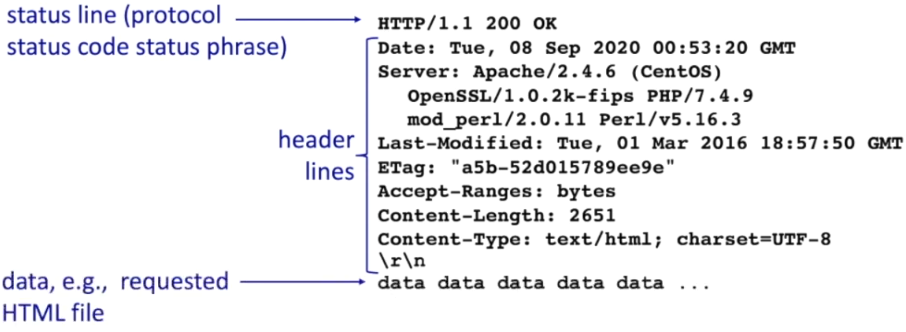

1. **What is Client-server architecture?**
- Host/Server
1. The host is always on.
2. Most of the time they have permanent IP address
3. Often can be found in colleges, data centers for scaling.

- Clients
1. Clients communicate by contacting and communicating with server.
2. The Client will be intermittently connected with the server.
3. Hence, they will not have a permanent IP address. They will be rather having dynamic addresses.
4. Most important, clients do not communicate with each other. Rather, they will
   communicate with server.
5. Examples: HTTP, IMPA, FTP

2. Explain URI, URL, URN and URC
- URI (Uniform Resource Identifier):
   - A URI is a string of characters used to identify a resource. It can refer 
  to a web resource, such as a document or image, or any other resource such 
  as a book or a person.
   - URIs can be further classified into two types: URLs and URNs.

- URL (Uniform Resource Locator):
   - A URL is a specific type of URI that provides the means to access a resource 
  on the internet. It typically includes 
     - the protocol used to access the resource (e.g., HTTP, HTTPS), 
     - the domain name or IP address where the resource is located
     - the specific path to the resource on that server.
   - For example, in the URL "https://www.example.com/index.html"
     - "https://" is the protocol, 
     - "www.example.com" is the domain name, 
     - and "/index.html" is the path to the resource.

- URN (Uniform Resource Name):
   - A URN is another type of URI that is used to uniquely identify a resource 
  without specifying its location or access method. 
     - Unlike URLs, which may change over time or be specific to a particular location, 
     URNs provide a persistent identifier for the resource.
   - An example of a URN is the ISBN (International Standard Book Number) for 
  books. Each book has a unique ISBN that serves as a persistent identifier for 
  that book, regardless of where it is located or how it is accessed.

- URC (Uniform Resource Citation):
   - A URC is not as commonly known as the other three. The goal of URCs is to 
   provide a structured and consistent way to reference
   online resources, including web pages, articles, videos, and more.
   -  This can be particularly useful in academic and research contexts where 
   proper citation is important for acknowledging sources and avoiding plagiarism.

3. What is Peer-peer(P2P) architecture?
- Peer-to-peer (P2P) architecture is a decentralized network model where 
participants, or peers, communicate and collaborate directly with each other 
without the need for a centralized server.
  - P2P networks, each peer can act as both a client and a server, sharing 
  resources and services with other peers in the network.
  - `Self Scalability:` New peers bring new service capacity, as well as new 
  service demands.
    - We can see the same thing in File sharing, where peer receives files from 
    one peers and shares it with other peers.
  - Peers are going to be intermittently with the internet. Hence, they are 
  going to change the IP address.
    - Hence, the coming and going architecture is much more complex than 
      server systems.
4. What is a socket?
- The application programming interfaces (API), bound to the transport layer, 
use an abstraction called socket.
- Processes going to send and receive messages using `Socket.`
  - The sending and receiving of messages is going to rely on underlying infrastructure 
  (transport layer, network layer or link layer), from a socket in the sending 
  end to the receiving end.
  - It is also important to know, there will be two sockets involved. One on the 
  sending side and one on the receiving side.

5. **How does a Socket work?**
- Sockets operate based on a client-server model where two programs 
(a client and a server) communicate over a network. Here's a simplified 
explanation of how sockets work:

- **Server Creation**:
    - The server program creates a socket by specifying the transport protocol 
   (TCP/UDP) and binds it to a specific port number.
    - It then listens for incoming connections on that port.

- **Client Connection**:
    - The client program also creates a socket and initiates a connection 
   request to the server's IP address and port number.
    - If using TCP, the server accepts the connection, establishing a 
   communication link.

- **Data Transfer**:
    - Once the connection is established, both the client and server can send 
   and receive data.
    - For TCP sockets, data is sent in a continuous stream, while UDP sockets 
   send data in discrete packets.

- **Closing the Connection**:
    - After the communication is complete, either side can close the connection.
    - For TCP, a four-way handshake process ensures the connection is 
   terminated gracefully.

6. Tell me the differences in TCP and UDP.
- **Reliable Transport:** 
  - TCP provides reliable transport between sending and receiving a process
  - UDP has a unreliable data transfer between sending and receiving processes
- **Flow Control:**
  - TCP guarantees that sender will not overwhelm the receiver
  - Does not provide flow control
- **Congestion Control:**
  - TCP sender is also congestion controlled when the network is overloaded
  - Does not provide congestion control
- **Connection Oriented:**
  - TCP also connection oriented means handshakes are needed
    before data from sender to receiver.
  - Does not provide connection control
- **Does not provide:**
  - TCP does not provide timing, minimum throughput guarantee, security
  - UDP also does not provide any of the support either.

**Question:** You might be wondering, for which cases do we need UDP?  
**Answer:** We can start with UDP and start adding other services, for example, 
Flow control and Congestion control on top of UDP.  

7. What is HTTP? Features of HTTP.
- HTTP - `Hypertext transfer protocol`
- Web's application layer protocol. HTTP follows the client and server model:
    - `Client:` The typical example of a client is the browser. In addition,
      there could be some other devices that can act as a client, for example,
      mobile apps.
    - `Server:` Web server sends (using HTTP protocol) objects in response to
      requests.

- HTTP uses TCP
  - HTTP clients open a TCP connection using a web server on port 80 whether
    through browser or other device.
  - One or more HTTP messages are exchanged between a client and server.
  - Then TCP connection is closed.

- HTTP is "stateless"
  - the server maintains no information about past client requests.
> Now you might ask why is that. Because, the protocols that hold
previous states have to go through a rigorous process of cleaning
previous statues, if one state in between fails.

8. Tell me the difference in Persistent and Non-Persistent HTTP. This question
is also the answer between Persistent TCP and non-persistent TCP.

- **Persistent TCP (HTTP/1.1)**:
    - **Connection**: The TCP connection remains open after sending a response, 
  allowing multiple requests and responses between the same client and server 
  over the same connection.
    - **Round Trip Times (RTTs)**: Only (one RTT + file transmission time) is 
  needed for all referenced objects, reducing the time to initiate subsequent 
  requests.
    - **Network Traffic**: Less network traffic due to fewer connections being
  opened and closed.
  - **CPU Overhead**: Lower CPU overhead because a single connection handles
  multiple objects.

- **Non-Persistent TCP (HTTP/1.0)**:
    - **Connection**: Each object requires a new TCP connection, which is 
  terminated after the object is transferred.
    - **Round Trip Times (RTTs)**: Two RTTs + file transmission time are 
  required per object—one for the TCP connection and another for the 
  HTTP request/response.
    - **Network Traffic**: More network traffic due to the frequent opening 
  and closing of connections.
    - **CPU Overhead**: Higher CPU overhead for handling multiple connections
  , as each object requires a separate connection.

9. Tell me how a Non-Persistent HTTP and Persistent HTTP works.
- Non-Persistent HTTP:
  1. HTTP `client` initiates TCP connection to HTTP server (process) at
     www.someSchool.edu on port 80
  2. HTTP `server at host www.someSchool.edu waiting for TCP connection at
    port 80 "accepts" connection, notifying the client.
    > Notice: In step 1 and 2, no HTTP connection has been flowed yet. That
   happens in STEP: 3
  3. HTTP `client` sends an HTTP request message (containing URL) into TCP connection.
    This http message indicates that the client wants to receive the base html file.
    someDepartment/home.index
  4. Now HTTP `server` receives a request message, forms `response message` containing
    a requested object, and sends a message into its socket.
  5. After sending the response message, the HTTP `server` closes the TCP connection.
  6. HTTP client receives a response message containing html file, displays.html. Finds,
    10 references jpeg objects.
  7. Now, all the steps from 1 to six have to be repeated for each of 10jpeg objects.

- Persistent HTTP:
  - Step 1–4 is the same. 
  - In step 5 after sending the object, the TCP connection is not closed in
  persistent HTTP.
  - Hence, the response time reduces to 1 RTT + file transmission time.

10. **HTTP Request and Response Message formats.**
- two types of HTTP messages: request, response
- **HTTP request message:**
    - ASCII (human-readable format)

  

A sample HTTP request has been given:
1. `Request line (GET, POST, HEAD Commands):` GET /index.html HTTP/1.1\r\n
2. `Header lines:`
    - **Host:** in this case www-net.cs.umass.edu\r\n
    - **User-Agent:** Mozilla
    - **Accept:** It is accepting application xml
    - **Accept-Language:** The language it accepts
    - **Accept-Encoding:** gzip, deflate\r\n
    - **Connection:** keep-alive\r\n, which states to keep the connection alive even
      after establishing.
3. `Entity body:` In this example we didn't need something in the entity body.
   But for POST request, we may need this part.

- **HTTP response message**
  

HTTP responses also have 3 Part:
1. `Status line`: It has the name of the protocol and the status code.
2. `Header Line`: Just like request message response also has similar attributes.
Example: Date, SServer, Last-Modified, ETag, Accept-Ranges, Content-Length
Content-Type.
3. `Data`: In this part the requested data in HTML.

10. **What are some HTTP verbs or methods?**
- **GET Method**
  - includes user data in the URL field of HTTP GET a request message (following a '?'):
      - www.somesite.com/animalsearch?monkeys&banana

- **POST Method**
  - Web page includes form input
  - user input sent from client to server in `entity body` of an HTTP POST 
  request message.

- **PUT Method**
  - uploads new file (object) to server
  - completely replaces file that exists at specified URL with content in 
  `entity body` of a PUT HTTP request message.

- **HEAD method**
  - asks for requests identical GET method without the response body.
  - It could be used to get the size of the object without retrieving the 
  object.

There are other methods such as **DELETE, CONNECT, OPTIONS, TRACE, PATCH**

11. **What are cookies and what cookies can be used for?**
- As mentioned above, HTTP is a stateless protocol, which means it does not 
hold previous states. When information from the previous states is necessary, 
Websites and client browsers use**cookies** to maintain some state between 
transactions.

- Four components to cookies:
    1. At some point, the server is going to send the client a cookie. 
  The cookie will hold a number.
    2. The next time, the client is going to send the number to the Server 
  in the cookie header line.
    3. The server will remember the requests and responses associated with 
  the cookie value. So it will have a history of interaction with the user.
  
**An example:**  
  
1. In the first step ebay `client` gives a request to amazon server.
    - Amazon `server` accepts the request, creates a cookie ID-1678, enters the information into
      the backend database and gives an HTTP response with cookie ID-1678.
    - For example, First time the client may be looking for some workout accessories. The server
      stores the history of workout accessories with the cookie ID-1678.
2. The next time, `client` gives a request to the amazon server, it does some cookie-specific actions.
    - It returns a traditional HTTP response.
    - For example, this time the `server` remembers the previous history using the cookie ID. Hence,
      it recommends users to buy specific workout accessories.
3. One week later, when the user gives another HTTP request with 1678 cookie-ID, the amazon server
   does another cookie-specific action.
    - It may remind user that, you forgot to buy workout accessories.

- What cookies can be used for:
1. `Authorization:` It can be used for authorization. The sever can remember
through cookies that you authorized.
2. `Shopping carts:` The server can keep a memory of what was in your shopping
cart using cookie.
3. `Recommendations:` based on your previous history tracked through cookies, 
the server can give some recommendations.
4. `User session state:` It can store of your browsing state.

12. **What is DNS? Why is DNS decentralized?**
- DNS(Domain name system) in hierarchy of many name servers, which
  provides domain name to IP address translation.
- **DNS is decentralized**
  - There could be a single point of failure
  - Given that the load of DNS, it will create tremendous control of service.
  - Given how important DNS is, just putting one DNS server will create a long
  RTT delays for the clients who are very far away from the server.
  - It would have been chaos to maintain one DNS server.
  - `In one word it is not possible to scale`

13. **Explain the Root, TLD, and Authoritative DNS server.**
1. **DNS: root name servers**
- The root server is the last resort if any name cannot be resolved.
  It cannot provide the IP address, but it is a good starting point.
- It's an incredibly important function for the internet. Sort of
  like a central nervous system.
    - The Internet cannot function without it.

2. **DNS: Top-level Domain (TLD) servers:**
- responsible for .com, .org, .net, .edu, .aero, .jobs, .museums, and
  all top-level country domains, e.g.: .cn, .uk, .fr, .ca, .jp
- This server has also been known as internet registries. If you want to register
  a new domain, this is the guys you go to.

3. **DNS: Authoritative DNS servers:**
- This server is responsible to resolve the names within the organization.
- it can be maintained by organization or service provider.
- The name suggests what it does. What this server says, is the ultimate
  result.

14. **Explain the different DNS records. A, NS, CNAME, and MX records.**
- **Type=A**
    - name is hostname
    - value is IP address
- **Type=NS**
    - name is domain(e.g., foo.com)
    - value is hostname of authoritative
      name server for this domain.
-  **type=CNAME**
  - name is alias name for some "canonical"
    (the real) name
    - www.ibm.com is really servereast.backup2.ibm.com
    - value is canonical name
- **type=MX**
    - value is the name of SMTP mail server associated with
      name

15. **What is DDos attack and Spoofing attacks in DNS?**
- ** Distributed Denial-of-Service(DDos) attacks:**
    - bombard root servers with traffic
        - It's not successful to date
        - traffic filtering
        - local DNS servers cache IPs of TLD(Top level domain)
          servers, allowing root server to bypass.
    - bombard TLD servers
        - It's potentially more dangerous
    - DDos attacks can be prevented from using firewalls.
- **Spoofing attacks:**
    - intercept DNS queries, returning bogus replies.
        - Only way to prevent it from accepting services from an
          authenticated request.
        - TC4033: DNSSEC provides authentication services